Walmart Recruiting II: Sales in Stormy Weather
================
Rishabh Vaish
12/24/2019

## Introduction

### Purpose and Goal

The sales of Walmart items are affected by the changes in weather
conditions around the stores. The purpose of this project is to predict
the sales of 111 weather-sensitive items present in 45 different Walmart
stores as they are affected by climate variations. The weather data
across 20 different weather stations are provided. We need to predict
the sales of items as they are affected by weather events i.e. the days
with excessive snowfall and/or rainfall. We predict the sales of items
on the day of the weather events, three days before and three days after
the weather events. The project focuses on an ordinary least squares
linear model. Many improvements are made in the linear model using the
concepts taught in the STAT425 course and then they are compared with
other more complex models like CatBoost and Bagged Tree.

### Data

Data is provided in 4 tables namely: train, test, weather, and key. The
“train” dataset has store number, item number, units sold by date and
key for mapping store to nearest weather station from 2012-01-01 to
2014-10-31. The weather table has weather information for all stations
for both training and testing period. The key table is used to map from
store number to the closest weather station number. The test data
contains the dates of weather events on which the predictions are to be
made.

### Methodology

The data is pre-processed and the NA values are imputed with the average
of the weather information a day before and a day after. Firstly, we
removed the item and store combinations that have zero units sold in the
training data. These items and store combinations will have zero
predictions in the test set. Then the weather events are marked and the
data within three days of weather event is picked. Feature engineering
is done for this data by adding variables derived from the date like the
day of the month, day of the week, and the quarter of the year. Another
column is created which marks whether the date was a holiday or not. The
highly correlated features are removed before modeling the remaining
non-zero units sold item store combinations ( ~255). A linear model was
built using just the weather variables provided and new features
engineered. This is considered as the base model and is further improved
using techniques like outlier detection and removing influential points.
The model is further improved by collinearity analysis and box-cox
transformation. Further advanced methods like forward/backward selection
with AIC/BIC criteria and LASSO is used to find the best smaller linear
model. This best smaller linear model was then compared with the
advanced models like CatBoost and Bagged tree.

## Exploratory Data Analysis

The following process was involved in EDA of the dataset, in order -

### Basic

  - Many columns of weather data had missing values marked as “M”, these
    values were replaced by NA
  - Some features of weather data were in character data format, they
    were converted to numeric wherever applicable
  - The “Codesum” column was removed from the data

### Missing Values

Since the weather data had a lot of missing values, they were handled
using different techniques instead of removing rows. Also, note that
“sunrise”, “sunset” and “snowfall” values are missing for all the rows
corresponding to station one. Thus they have been handled separately \*
Missing values in all the columns like “tmax”, “dewpoint”, “sealevel”
etc have been replaced by the average of values a day before and a day
after the missing day. This is based on the assumption that weather
change occurs in a linear manner instead of random ups and downs \*
Special columns like “sunrise”, “sunset” and “snowfall” which have a lot
of missing values, have been imputed using the median of the remaining
data

### Feature Engineering

Some new features were derived from the existing features, mainly “date”
and added to the weather dataset for further modelling. Following are
the features that were added - \* Day - To incorporate for the day of
the week. Eg - “Saturday” and “Sunday” would have higher sales than
other days. It was stored as a categorical feature \* Month - To handle
the effect of change in sales with seasons. Eg - “December” is expected
to have different sales than “July”. It was stored as a categorical
feature \* Year - To incorporate the change in sales with yearly trends
and inflation. It was also stored as a categorical feature \* Day\_month
- To incorporate for the change in buying patterns within a month. Eg -
People are more likely to buy at the time of salary disbursement. It is
a numerical feature \* Week - Another way to incorporate the effect of
change in sales with seasons. It is a numerical feature \* Is\_holiday -
This feature marks the days of national holidays. Eg - People are more
probable to shop on the holidays. It is a numeric feature

### Misc

  - All the store-item combinations with zero unit sales in the training
    set were removed and these combinations will be predicted as zero on
    testing data.
  - The weather events are defined as rain \> 1 and snowfall \>2. Data
    containing the rows corresponding to weather events and three days
    before & after the weather event were stored separately as trainset.
    All the further modelling and processing was done on this data.
  - The weather data was then merged with the trainset using the key
    table. Firstly, the key was added to trainset using a left join in
    R. Then the weather data with new features was merged with trainset
    using another left join on trainset in R.
  - An ID of the format store\_item\_date was also added to the dataset
    for results reporting.
  - Final train data dimensions after EDA is 222,969 \* 22

### Graphical Analysis

  - Histogram of units sold shows a skew towards the left side. Taking a
    log of units gives a more normal distribution for dependent
    variables. This will help in the linear model in further analysis.

  - The correlation plot for the initial weather features is shown.
    Highly correlated features were removed before building a full
    linear model because they don’t add much value to the model.

  - A boxplot of all the variables is generated, to visualize the
    distribution and outliers present in the data. These outliers were
    later handled for improvement to the linear model

<!-- end list -->

``` r
# Data Load
library(readr)
key <- read_csv("data/key.csv")
test <- read_csv("data/test.csv")
train <- read_csv("data/train.csv")
weather <- read_csv("data/weather.csv")
sample <- read_csv("data/sampleSubmission.csv")

#replace M with NA
library(dplyr)
weather[, 3:ncol(weather)] <- na_if(weather[, 3:ncol(weather)], 'M')

#convert to numeric
char_col <-
  colnames(weather[which(sapply(weather, class) == "character")])
char_col <- char_col[-9]
weather[char_col] <- sapply(weather[char_col], as.numeric)

#handle NA
# order the weather dataframe by station then date
weather <- weather[order(weather$station_nbr, weather$date), ]
#take average of previous and next value
library(zoo)
weather$tmax <-
  (na.locf(weather$tmax) + rev(na.locf(rev(weather$tmax)))) / 2
weather$tmin <-
  (na.locf(weather$tmin) + rev(na.locf(rev(weather$tmin)))) / 2
weather$dewpoint <-
  (na.locf(weather$dewpoint) + rev(na.locf(rev(weather$dewpoint)))) / 2
weather$wetbulb <-
  (na.locf(weather$wetbulb) + rev(na.locf(rev(weather$wetbulb)))) / 2
weather$heat <-
  (na.locf(weather$heat) + rev(na.locf(rev(weather$heat)))) / 2
weather$cool <-
  (na.locf(weather$cool) + rev(na.locf(rev(weather$cool)))) / 2
weather$preciptotal <-
  (na.locf(weather$preciptotal) + rev(na.locf(rev(
    weather$preciptotal
  )))) / 2
weather$stnpressure <-
  (na.locf(weather$stnpressure) + rev(na.locf(rev(
    weather$stnpressure
  )))) / 2
weather$sealevel <-
  (na.locf(weather$sealevel) + rev(na.locf(rev(weather$sealevel)))) / 2
weather$resultspeed <-
  (na.locf(weather$resultspeed) + rev(na.locf(rev(
    weather$resultspeed
  )))) / 2
weather$resultdir <-
  (na.locf(weather$resultdir) + rev(na.locf(rev(weather$resultdir)))) / 2
weather$avgspeed <-
  (na.locf(weather$avgspeed) + rev(na.locf(rev(weather$avgspeed)))) / 2
#recalculate tavg
weather$tavg <- ceiling((weather$tmax + weather$tmin) / 2)

#imputing special cases with median
weather <- tbl_df(data.frame(lapply(weather, function(x) {
  if (is.numeric(x))
    ifelse(is.na(x), median(x, na.rm = T), x)
  else
    x
})))

#handle codesum
weather$codesum <- NULL
summary(weather)
```

    ##   station_nbr         date                 tmax             tmin             tavg       
    ##  Min.   : 1.00   Min.   :2012-01-01   Min.   :-11.00   Min.   :-21.00   Min.   :-16.00  
    ##  1st Qu.: 6.00   1st Qu.:2012-09-21   1st Qu.: 60.00   1st Qu.: 37.00   1st Qu.: 49.00  
    ##  Median :11.00   Median :2013-06-04   Median : 76.00   Median : 53.00   Median : 65.00  
    ##  Mean   :10.55   Mean   :2013-06-04   Mean   : 71.52   Mean   : 50.68   Mean   : 61.35  
    ##  3rd Qu.:16.00   3rd Qu.:2014-02-17   3rd Qu.: 86.00   3rd Qu.: 66.00   3rd Qu.: 76.00  
    ##  Max.   :20.00   Max.   :2014-10-31   Max.   :114.00   Max.   : 88.00   Max.   :100.00  
    ##      depart          dewpoint         wetbulb            heat             cool       
    ##  Min.   :-35.00   Min.   :-24.00   Min.   :-15.00   Min.   : 0.000   Min.   : 0.000  
    ##  1st Qu.:  2.00   1st Qu.: 33.00   1st Qu.: 42.00   1st Qu.: 0.000   1st Qu.: 0.000  
    ##  Median :  2.00   Median : 52.00   Median : 56.00   Median : 1.000   Median : 0.000  
    ##  Mean   :  1.72   Mean   : 47.51   Mean   : 53.61   Mean   : 9.564   Mean   : 5.738  
    ##  3rd Qu.:  2.00   3rd Qu.: 64.00   3rd Qu.: 68.00   3rd Qu.:16.000   3rd Qu.:11.000  
    ##  Max.   : 33.00   Max.   : 77.00   Max.   : 80.00   Max.   :81.000   Max.   :35.000  
    ##     sunrise        sunset        snowfall         preciptotal    stnpressure   
    ##  Min.   :406   Min.   :1611   Min.   : 0.00000   Min.   :0.00   Min.   :23.72  
    ##  1st Qu.:558   1st Qu.:1828   1st Qu.: 0.00000   1st Qu.:0.00   1st Qu.:29.13  
    ##  Median :602   Median :1833   Median : 0.00000   Median :0.00   Median :29.43  
    ##  Mean   :593   Mean   :1828   Mean   : 0.02841   Mean   :0.14   Mean   :29.19  
    ##  3rd Qu.:607   3rd Qu.:1838   3rd Qu.: 0.00000   3rd Qu.:0.05   3rd Qu.:29.75  
    ##  Max.   :740   Max.   :1949   Max.   :16.20000   Max.   :7.36   Max.   :30.61  
    ##     sealevel      resultspeed       resultdir        avgspeed     
    ##  Min.   :29.16   Min.   : 0.000   Min.   : 1.00   Min.   : 0.000  
    ##  1st Qu.:29.90   1st Qu.: 3.300   1st Qu.:12.00   1st Qu.: 5.200  
    ##  Median :30.02   Median : 5.800   Median :18.00   Median : 7.500  
    ##  Mean   :30.02   Mean   : 6.494   Mean   :18.54   Mean   : 7.959  
    ##  3rd Qu.:30.15   3rd Qu.: 8.800   3rd Qu.:26.00   3rd Qu.: 9.900  
    ##  Max.   :30.80   Max.   :28.400   Max.   :36.00   Max.   :28.700

``` r
#adding more variables
weather$day <- as.factor(weekdays(weather$date))
weather$month <- as.factor(months(weather$date))
dates <- strptime(as.character(weather$date), format = "%Y-%m-%d")
weather$year <- as.factor(format(dates,'%Y'))
weather$day_month <- as.numeric(format(dates, "%d"))
weather$week <- as.numeric(format(dates, "%V"))
library(tis)
weather$is_holiday <-
  ifelse(isHoliday(
    weather$date,
    goodFriday = F,
    board = T,
    businessOnly = T
  ) == TRUE,
  1,
  0)

#find days of events
event_dates <-
  unique(weather[which(weather$preciptotal > 1 |
                         weather$snowfall > 2), "date"])

event_date_set <- rep(0, nrow(event_dates) * 7)
j = 1
for (i in 1:nrow(event_dates)) {
  event_date_set[j] = event_dates[i, 1] - 3
  j = j + 1
  event_date_set[j] = event_dates[i, 1] - 2
  j = j + 1
  event_date_set[j] = event_dates[i, 1] - 1
  j = j + 1
  event_date_set[j] = event_dates[i, 1]
  j = j + 1
  event_date_set[j] = event_dates[i, 1] + 1
  j = j + 1
  event_date_set[j] = event_dates[i, 1] + 2
  j = j + 1
  event_date_set[j] = event_dates[i, 1] + 3
  j = j + 1
}
event_date_set <- unique(event_date_set)

#weather on event days
weather_event <- weather[which(weather$date %in% event_date_set),]

#Find all the store/items with zero sales
library(dplyr)
units_sold <- train %>%
  group_by(store_nbr, item_nbr) %>%
  summarise(total_sales = sum(units))
#zero units sold
zero_units_sold <-
  units_sold[which(units_sold$total_sales == 0), 1:2]
#atleast one unit sold
units_sold <- units_sold[which(units_sold$total_sales != 0), 1:2]

#graphs
par(mfrow = c(1,2))
hist(train$units)
hist(log(train$units))
```

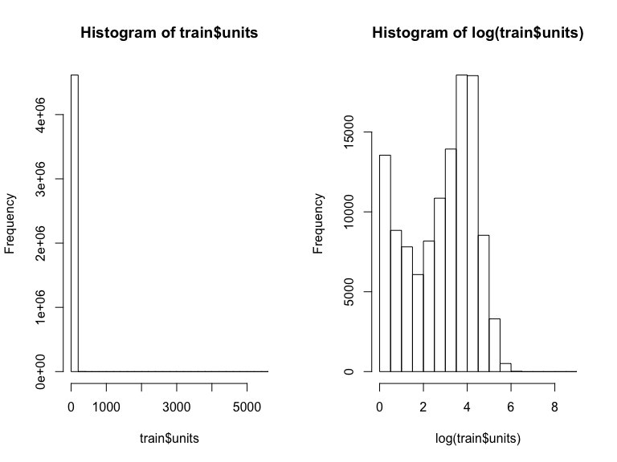

``` r
#remove useless data
rm(char_col)
rm(event_dates)
rm(event_date_set)
rm(i,j)
```

## Linear Regression

Before creating a full model, we tested the kaggle score with all the
predictions for units sold to be zero. The kaggle score for this
submission was 0.51, we can consider this as the base score before
making a linear model.

### Full Linear Model

In order to create a linear model, we first remove the highly correlated
variables in order to remove redundant features. A cut off of 0.75 was
used to remove 6 features namely : “wetbulb”, “tmin”, “tavg”,
“dewpoint”, “tmax” and “avgspeed”. After removing these features a
linear model named “lm\_initial” was created with the following summary
-

### Summary

  - The residuals had a median of -6.1 and a standard error of 36.66 on
    222,931 degrees of freedom.
  - The goodness of fit is determined by R-squared value which came out
    to be 0.1418, this is not a good fit. Adjusted R-squared is reported
    to be 0.1416
  - The F-statistic is 995.2 which is good and is significant because
    the p-value is significantly close to zero. Thus we can establish
    this model is better than a null model.

### Diagnostics

The diagnostics for the linear model are as follows -

  - The residual vs fitted plot shows a linear relationship between
    residuals and fitted values. The spread across the linear trendline
    shows that the residuals are not completely uncorrelated.

  - The normal QQ plot shows a departure from the linear trendline, thus
    signifying that the residuals are not normally distributed. A need
    for transformation is implied.

  - The scale location plot is used to check for homoscedasticity. The
    unequal spread across the trendline shows heteroscedasticity. This
    is later confirmed using BP Test.

  - Residual vs leverage plot helps us find out the influential points.
    The plot shows many leverage points. Their influence is later
    confirmed using a cooks distance measure

### Kaggle Score

This model gives a kaggle score of 0.39744

``` r
# using the subset with non zero elements sold for training
# rest will be marked as zero
train_subset <-
  merge(
    x = units_sold,
    y = train,
    by = c("store_nbr", "item_nbr"),
    all.x = TRUE
  )
test_subset <-
  merge(
    x = units_sold,
    y = test,
    by = c("store_nbr", "item_nbr"),
    all.x = TRUE
  )

#find key for train/test subset
train_subset_key <-
  merge(x = train_subset,
        y = key,
        by = "store_nbr",
        all.x = TRUE)
test_subset_key <-
  merge(x = test_subset,
        y = key,
        by = "store_nbr",
        all.x = TRUE)

#adding weather data to test/train subset
trainset <-
  merge(x = train_subset_key,
        y = weather_event,
        by = c("station_nbr", "date"))
testset <-
  merge(x = test_subset_key,
        y = weather_event,
        by = c("station_nbr", "date"))
#creating an ID for reference
testset$id <-
  paste(testset$store_nbr,
        "_",
        testset$item_nbr,
        "_",
        testset$date,
        sep = "")

#shifting units to last column
trainset$unit_temp <- trainset$units
trainset$units <- NULL
trainset$units <- trainset$unit_temp
trainset$unit_temp <- NULL

#checking correlation before lm
library(caret)
#check correlation between numeric variables
trainset_num <-
  trainset[which(sapply(trainset, class) == "numeric")]
testset_num <- testset[which(sapply(testset, class) == "numeric")]
descrCor <-  cor(trainset_num)
#high correlation
highlyCorDescr <- findCorrelation(descrCor, cutoff = .75)
colnames(trainset_num[, highlyCorDescr])
```

    ## [1] "wetbulb"  "tmin"     "tavg"     "dewpoint" "tmax"     "avgspeed"

``` r
#remove highly correlated data
trainset$wetbulb <- NULL
trainset$dewpoint <- NULL
trainset$tmin <- NULL
trainset$tavg <- NULL
trainset$tmax <- NULL
trainset$avgspeed <- NULL

#some graphs
library(reshape2)
melted_cormat <- melt(descrCor)
head(melted_cormat)
```

    ##          Var1        Var2       value
    ## 1 station_nbr station_nbr  1.00000000
    ## 2   store_nbr station_nbr  0.26109086
    ## 3    item_nbr station_nbr -0.12702302
    ## 4        tmax station_nbr -0.01526027
    ## 5        tmin station_nbr -0.06173167
    ## 6        tavg station_nbr -0.03896326

``` r
library(ggplot2)
ggplot(data = melted_cormat, aes(x=Var1, y=Var2, fill=value)) + 
  geom_tile()
```

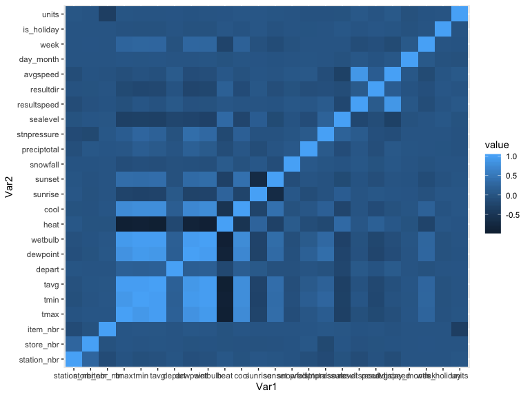

``` r
#boxplot of data
box_data <- weather[, -2]
box_data$sunrise <- NULL
box_data$sunset <- NULL
boxplot(box_data, main = "Boxplot of variables")
```

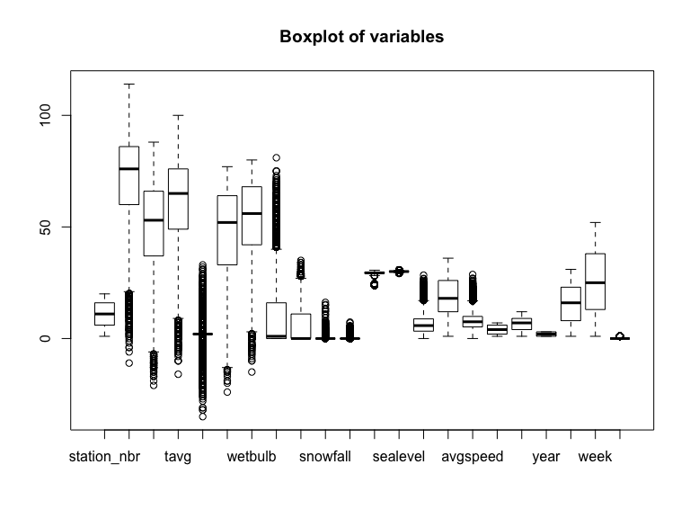

``` r
# Simple OLS
lm_initial <- lm(units ~ . , data = trainset)
summary(lm_initial)
```

    ## 
    ## Call:
    ## lm(formula = units ~ ., data = trainset)
    ## 
    ## Residuals:
    ##    Min     1Q Median     3Q    Max 
    ##  -61.6  -18.1   -6.1    4.6 5528.8 
    ## 
    ## Coefficients:
    ##                  Estimate Std. Error  t value Pr(>|t|)    
    ## (Intercept)    -1.336e+04  6.816e+03   -1.961 0.049927 *  
    ## station_nbr    -1.439e-01  1.682e-02   -8.553  < 2e-16 ***
    ## date            8.650e-01  4.417e-01    1.958 0.050219 .  
    ## store_nbr      -2.660e-02  6.322e-03   -4.207 2.58e-05 ***
    ## item_nbr       -4.043e-01  2.283e-03 -177.085  < 2e-16 ***
    ## depart         -1.721e-01  2.018e-02   -8.530  < 2e-16 ***
    ## heat           -2.576e-02  9.064e-03   -2.842 0.004479 ** 
    ## cool            3.461e-01  1.683e-02   20.563  < 2e-16 ***
    ## sunrise         2.404e-02  2.245e-03   10.711  < 2e-16 ***
    ## sunset          2.482e-02  2.292e-03   10.833  < 2e-16 ***
    ## snowfall        4.820e-01  2.882e-01    1.672 0.094429 .  
    ## preciptotal    -2.224e+00  2.511e-01   -8.859  < 2e-16 ***
    ## stnpressure    -6.940e-01  4.751e-02  -14.607  < 2e-16 ***
    ## sealevel        7.777e-01  4.999e-01    1.556 0.119785    
    ## resultspeed     5.216e-01  2.010e-02   25.956  < 2e-16 ***
    ## resultdir      -4.130e-02  8.455e-03   -4.885 1.04e-06 ***
    ## dayMonday       1.508e+00  2.962e-01    5.092 3.55e-07 ***
    ## daySaturday     3.708e+00  2.883e-01   12.860  < 2e-16 ***
    ## daySunday       5.889e+00  2.891e-01   20.367  < 2e-16 ***
    ## dayThursday    -1.738e+00  2.885e-01   -6.025 1.69e-09 ***
    ## dayTuesday     -8.159e-01  2.916e-01   -2.798 0.005146 ** 
    ## dayWednesday   -1.744e+00  2.903e-01   -6.010 1.86e-09 ***
    ## monthAugust    -1.059e+02  5.389e+01   -1.966 0.049286 *  
    ## monthDecember  -2.063e+02  1.078e+02   -1.914 0.055651 .  
    ## monthFebruary   5.336e+01  2.620e+01    2.037 0.041692 *  
    ## monthJanuary    8.199e+01  3.990e+01    2.055 0.039861 *  
    ## monthJuly      -8.082e+01  4.019e+01   -2.011 0.044355 *  
    ## monthJune      -5.428e+01  2.694e+01   -2.015 0.043923 *  
    ## monthMarch      2.768e+01  1.370e+01    2.021 0.043319 *  
    ## monthMay       -2.723e+01  1.325e+01   -2.054 0.039941 *  
    ## monthNovember  -1.813e+02  9.455e+01   -1.918 0.055147 .  
    ## monthOctober   -1.565e+02  8.084e+01   -1.936 0.052910 .  
    ## monthSeptember -1.320e+02  6.758e+01   -1.953 0.050776 .  
    ## year2013       -3.188e+02  1.613e+02   -1.977 0.048094 *  
    ## year2014       -6.379e+02  3.225e+02   -1.978 0.047951 *  
    ## day_month      -1.099e+00  4.414e-01   -2.489 0.012797 *  
    ## week           -6.973e-02  3.031e-02   -2.300 0.021425 *  
    ## is_holiday     -1.912e+00  5.256e-01   -3.637 0.000276 ***
    ## ---
    ## Signif. codes:  0 '***' 0.001 '**' 0.01 '*' 0.05 '.' 0.1 ' ' 1
    ## 
    ## Residual standard error: 36.66 on 222931 degrees of freedom
    ## Multiple R-squared:  0.1418, Adjusted R-squared:  0.1416 
    ## F-statistic: 995.2 on 37 and 222931 DF,  p-value: < 2.2e-16

``` r
plot(lm_initial)
```

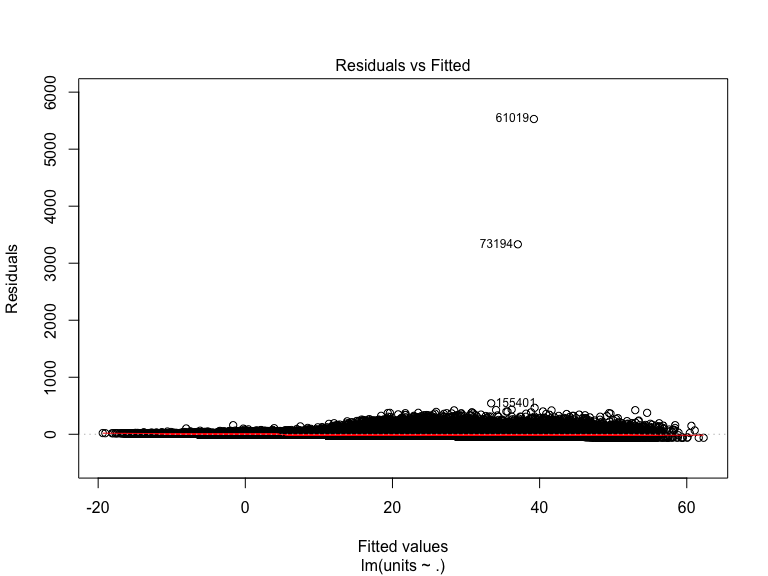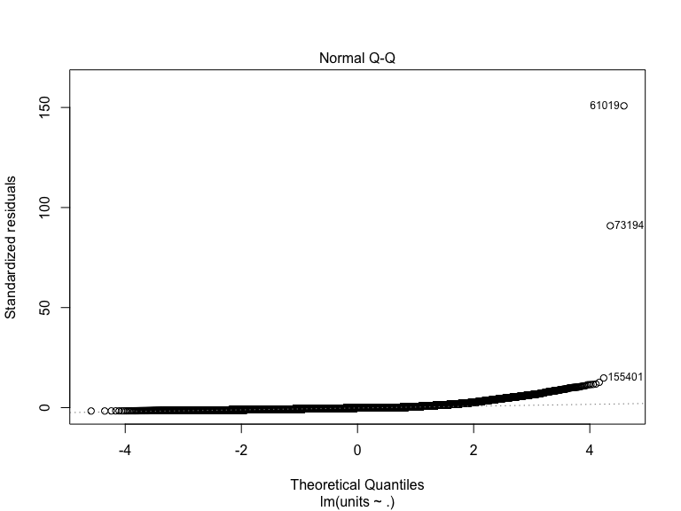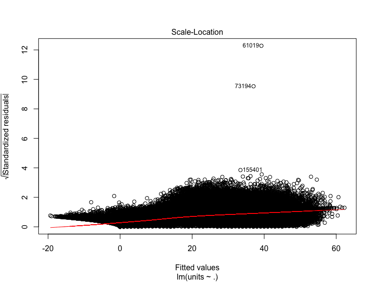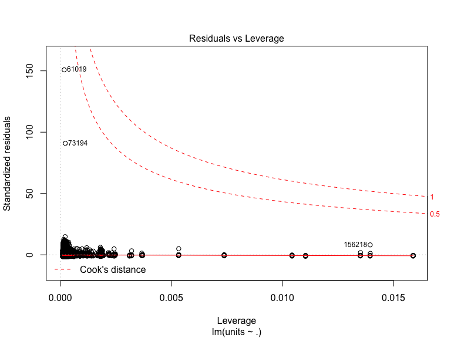

``` r
#predictions using OLS for Kaggle score
testset$pred <- predict(lm_initial, newdata = testset)
sample$units <- testset[match(sample$id, testset$id), "pred"]
sample$units[is.na(sample$units)] <- 0
sample$units <- ifelse(sample$units <= 0 , 0, sample$units)

write.csv(sample, "submit.csv", row.names = FALSE)
#kaggle score = 0.39744

#remove extra things
rm(dates, descrCor, test_subset, test_subset_key, testset_num)
rm(train_subset, train_subset_key, trainset_num)
```

## Improvements

The kaggle score and R-squared are used as a metric for judging the
improvement. The kaggle score is reported at each step of improvement.
The following steps were taken to improve the full linear model -

### Outliers and Influential Points

  - Outliers are points that deviate from general trend followed by the
    data. Such points can lead to decrease in overall model performance
    and hence need to be dealt with.

  - The residual studentized values were calculated using the full model
    and all the points with studentized residual greater than 2 i.e. the
    residual is more than 2 standard deviations away from the mean were
    removed.

  - This method removed around 8535 rows and the kaggle score was
    improved to 0.37250

  - Influential points also need to be removed from the data since they
    can have a negative impact on the overall model. Cook’s distance is
    a measure to find influential points. It is directly proportional to
    the difference in predicted value for an observation when the model
    is fitted with/without that particular observation.

  - Since the residual vs leverage plot showed a lot of leverage points,
    we checked the cooks distance for each and every point and used 4/n
    (~0.00002) as the cut off for removing influential points, where n
    is the total no. of observations.

  - This technique further removed 428 rows and improved the kaggle
    score to 0.370

### Collinearity

  - Collinearity is a condition when one or more variables are linearly
    dependant on some other variables in the data. \* Collinearity can
    lead to problems like not getting the optimal solution and the
    non-identifiability of the linear model.
  - In order to check for collinearity in variables, we calculated the
    Variance Inflation factors for the full model. \* A VIF value
    greater than 10 is considered to be a multicollinearity issue.
  - The initial check showed three variables with high VIF namely: Date,
    year and Day\_month. We removed “date” and rebuild a model to
    recheck the VIF scores. This time all the VIF scores were below 5.
  - By removing the “date” column we were able to handle the issue of
    collinearity and rechecked the kaggle score to be consistent
    (~0.371). This was expected because we just removed a variable
    collinear with other variables and removing it didn’t actually
    remove any information from the model.

### Homoscedasticity

  - A BP test was done to check for the assumption of constant variance.
    The null hypothesis of homoscedasticity was rejected because the
    test produced a P-value of 1.214e-09.
  - Thus, we need a transformation to tackle heteroscedasticity and
    non-normality among the residuals.

### Transformations

  - We implemented a box-cox transformation on the initial full model.
    Box cox transformation is known for reducing non-normality of errors
    as well as heteroscedasticity. It involves raising the target y to a
    power lambda and then obtain a lambda estimate such that likelihood
    of data obtained is maximised. The lambda value obtained is
    generally rounded off to the nearest integer. For lambda=0, log
    transformation is performed.
  - The lambda value for maximum likelihood was achieved between -0.5
    and 0.
  - We selected 0 as the optimal lambda and took a logarithm of units
    plus one sold item as the dependent variable.
  - We then took the predictions of this model and subtracted one to
    achieve our final prediction after transformation.
  - The kaggle score improved significantly to 0.32593

### Best Subset Selection

  - In order to select a smaller model with similar or better prediction
    than the full model, we implemented various strategies like forward/
    backward selection with AIC/BIC criteria. An ANOVA F-test was done
    to check if the new smaller model is better than the full model.
    Following were the results achieved -

  - AIC Backward - This gave the same model as the full model, showing
    none of the smaller models is better.

  - BIC Backwards - Since BIC has a higher penalty than AIC, so it
    selects a smaller model with just three features less than the full
    model namely: “snowfall”, “preciptotal” and “stnpressure”. An ANOVA
    F-test on this model shows a p-value smaller than 0.05 thus we
    reject the null hypothesis and conclude that the smaller model is
    not better than the full model

  - AIC Forward - This gave a smaller model with features like
    “stnpressure” removed. An ANOVA F-test on this model gave P-value
    \> 0.05, thus we can establish that the smaller model is equivalent
    to the larger model. The kaggle score for this model is 0.326

  - BIC Forward - The model was significantly smaller than the full
    model. The ANOVA F-test shows a high P-value thus this model is not
    equivalent to the full model. We can discard this model.

  - Using AIC/BIC criteria, AIC Forward stepwise selection gives the
    best model, with “stnpressure” removed from the full model. We tried
    a stepwise selection with different criteria, but the improvement in
    results is not significant. Thus we can conclude that the subset of
    these features is not producing a good enough or comparable model.

### LASSO

Another way of selecting variables for a linear model is to use LASSO
based linear regression. LASSO adds l1 penalty to the loss function
which is proportional to the coefficients and, thus shrinks the
coefficients leading to less overfitting. Generally in this technique
coefficients of some variables which are not important are reduced to
zero. This is because of the intersection of constraint boundaries with
the cost function contours at specific points. So we implemented LASSO
using cv.glmnet and the coefficients of “snowfall” and “preciptotal”
reduced to zero. Training a linear model with remaining features
resulted in a kaggle score of 0.326.

### Best Linear Model

The best linear model after all the improvements was the one after
implementing box-cox transformation which gave a Kaggle score 0.32593.
Here we are discussing the summary and diagnostics of the best linear
model as compared with the full model. Thus showing the overall
improvements

### Summary

  - The residuals had a median of -0.2 and a standard error of 1.367
    which is a good improvement as compared to -6.1 and 36.66 of the
    full model
  - The goodness of fit determined by R-squared value which came out to
    be 0.1418 for the full linear model, has increased to 0.304.
  - The F-statistic has also improved significantly from 995.2 for the
    full model to 2598 for the best model. Both the P-values show that
    the F-statistic is significant and hence the model is useful

### Diagnostics

  - The residual vs fitted plot still show a linear relationship between
    residuals and fitted values. Although, the spread across the linear
    trendline shows that the residuals decrease with increasing fitted
    values. Hence the residuals are not uncorrelated.

  - The normal QQ plot has improved from earlier but it still shows a
    departure from the linear trendline towards the ends, thus
    signifying that the residuals are not normally distributed.

  - The unequal spread across the trendline shows heteroscedasticity

  - Some leverage points are present but all the influential points are
    removed.

<!-- end list -->

``` r
#check for outliers
trainset$student.res = rstandard(lm_initial)
trainset_new <- trainset[which(abs(trainset$student.res) <= 2), ]
trainset_new$student.res <- NULL
trainset$student.res <- NULL

#fit a model without outliers
lm_second <- lm(units ~ . , data = trainset_new)
summary(lm_second)
```

    ## 
    ## Call:
    ## lm(formula = units ~ ., data = trainset_new)
    ## 
    ## Residuals:
    ##     Min      1Q  Median      3Q     Max 
    ## -42.171 -12.755  -3.722   4.132  91.468 
    ## 
    ## Coefficients:
    ##                  Estimate Std. Error  t value Pr(>|t|)    
    ## (Intercept)    -1.674e+04  4.062e+03   -4.120 3.80e-05 ***
    ## station_nbr    -1.289e-01  1.017e-02  -12.674  < 2e-16 ***
    ## date            1.075e+00  2.633e-01    4.084 4.43e-05 ***
    ## store_nbr       1.464e-02  3.756e-03    3.899 9.68e-05 ***
    ## item_nbr       -3.077e-01  1.347e-03 -228.407  < 2e-16 ***
    ## depart         -1.803e-01  1.214e-02  -14.857  < 2e-16 ***
    ## heat           -9.502e-02  5.366e-03  -17.708  < 2e-16 ***
    ## cool            2.878e-01  9.966e-03   28.881  < 2e-16 ***
    ## sunrise         5.118e-02  1.338e-03   38.248  < 2e-16 ***
    ## sunset          4.936e-02  1.365e-03   36.151  < 2e-16 ***
    ## snowfall       -2.795e-02  1.718e-01   -0.163  0.87080    
    ## preciptotal    -4.512e-01  1.481e-01   -3.047  0.00231 ** 
    ## stnpressure    -6.496e-01  2.807e-02  -23.143  < 2e-16 ***
    ## sealevel        2.529e+00  2.963e-01    8.538  < 2e-16 ***
    ## resultspeed     3.149e-01  1.194e-02   26.375  < 2e-16 ***
    ## resultdir      -4.199e-02  5.018e-03   -8.369  < 2e-16 ***
    ## dayMonday       1.080e+00  1.754e-01    6.158 7.38e-10 ***
    ## daySaturday     1.636e+00  1.713e-01    9.551  < 2e-16 ***
    ## daySunday       2.509e+00  1.722e-01   14.573  < 2e-16 ***
    ## dayThursday    -1.012e+00  1.705e-01   -5.936 2.93e-09 ***
    ## dayTuesday     -2.141e-01  1.725e-01   -1.241  0.21444    
    ## dayWednesday   -8.613e-01  1.716e-01   -5.021 5.16e-07 ***
    ## monthAugust    -1.330e+02  3.212e+01   -4.142 3.44e-05 ***
    ## monthDecember  -2.578e+02  6.424e+01   -4.013 6.00e-05 ***
    ## monthFebruary   6.517e+01  1.561e+01    4.174 3.00e-05 ***
    ## monthJanuary    1.001e+02  2.378e+01    4.208 2.57e-05 ***
    ## monthJuly      -1.007e+02  2.395e+01   -4.203 2.63e-05 ***
    ## monthJune      -6.772e+01  1.606e+01   -4.218 2.47e-05 ***
    ## monthMarch      3.426e+01  8.165e+00    4.195 2.73e-05 ***
    ## monthMay       -3.325e+01  7.899e+00   -4.209 2.56e-05 ***
    ## monthNovember  -2.264e+02  5.635e+01   -4.017 5.89e-05 ***
    ## monthOctober   -1.946e+02  4.818e+01   -4.039 5.37e-05 ***
    ## monthSeptember -1.650e+02  4.028e+01   -4.097 4.19e-05 ***
    ## year2013       -3.940e+02  9.613e+01   -4.098 4.17e-05 ***
    ## year2014       -7.876e+02  1.922e+02   -4.097 4.18e-05 ***
    ## day_month      -1.159e+00  2.631e-01   -4.407 1.05e-05 ***
    ## week           -5.259e-02  1.787e-02   -2.943  0.00325 ** 
    ## is_holiday     -1.784e+00  3.114e-01   -5.727 1.02e-08 ***
    ## ---
    ## Signif. codes:  0 '***' 0.001 '**' 0.01 '*' 0.05 '.' 0.1 ' ' 1
    ## 
    ## Residual standard error: 21.32 on 214397 degrees of freedom
    ## Multiple R-squared:  0.2193, Adjusted R-squared:  0.2192 
    ## F-statistic:  1628 on 37 and 214397 DF,  p-value: < 2.2e-16

``` r
#plot the graph after outliers removal
par(mforw = c(1, 2))
plot(rstudent(lm_initial), main = "Full data")
```

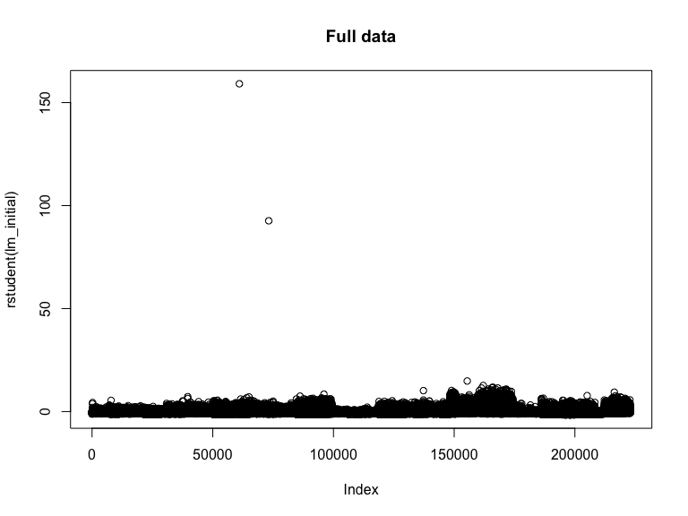

``` r
plot(rstudent(lm_second), main = "Removed outliers")
```

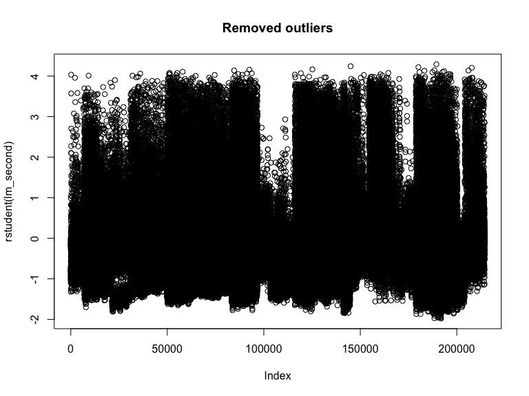

``` r
#make predictions after outliers removal
testset$pred <- predict(lm_second, newdata = testset)
sample$units <- testset[match(sample$id, testset$id), "pred"]
sample$units[is.na(sample$units)] <- 0
sample$units <- ifelse(sample$units <= 0 , 0, sample$units)
write.csv(sample, "submit2.csv", row.names = FALSE)
# kaggle score = 0.37250

#check for influential points using 4/n as cut off
trainset$cooks = cooks.distance(lm_initial)
trainset$student.res = rstandard(lm_initial)
trainset_new <-
  trainset[which(abs(trainset$cooks) <= 0.00002 &
                   abs(trainset$student.res) <= 2), ]
trainset_new$cooks <- NULL
trainset$cooks <- NULL
trainset_new$student.res <- NULL
trainset$student.res <- NULL

#fit a model without influential points
lm_third <- lm(units ~ . , data = trainset_new)
summary(lm_third)
```

    ## 
    ## Call:
    ## lm(formula = units ~ ., data = trainset_new)
    ## 
    ## Residuals:
    ##     Min      1Q  Median      3Q     Max 
    ## -41.852 -12.638  -3.694   4.141  91.738 
    ## 
    ## Coefficients:
    ##                  Estimate Std. Error  t value Pr(>|t|)    
    ## (Intercept)    -1.957e+04  4.038e+03   -4.846 1.26e-06 ***
    ## station_nbr    -1.318e-01  1.010e-02  -13.046  < 2e-16 ***
    ## date            1.259e+00  2.617e-01    4.811 1.50e-06 ***
    ## store_nbr       1.497e-02  3.729e-03    4.014 5.98e-05 ***
    ## item_nbr       -3.061e-01  1.337e-03 -228.862  < 2e-16 ***
    ## depart         -1.808e-01  1.210e-02  -14.943  < 2e-16 ***
    ## heat           -9.967e-02  5.337e-03  -18.675  < 2e-16 ***
    ## cool            2.877e-01  9.890e-03   29.090  < 2e-16 ***
    ## sunrise         4.923e-02  1.330e-03   37.020  < 2e-16 ***
    ## sunset          4.823e-02  1.359e-03   35.494  < 2e-16 ***
    ## snowfall        9.126e-02  2.769e-01    0.330    0.742    
    ## preciptotal    -1.052e+00  1.506e-01   -6.988 2.79e-12 ***
    ## stnpressure    -6.420e-01  2.787e-02  -23.035  < 2e-16 ***
    ## sealevel        2.471e+00  2.944e-01    8.395  < 2e-16 ***
    ## resultspeed     3.013e-01  1.187e-02   25.388  < 2e-16 ***
    ## resultdir      -4.292e-02  4.988e-03   -8.606  < 2e-16 ***
    ## dayMonday       1.021e+00  1.743e-01    5.859 4.66e-09 ***
    ## daySaturday     1.635e+00  1.700e-01    9.617  < 2e-16 ***
    ## daySunday       2.510e+00  1.709e-01   14.685  < 2e-16 ***
    ## dayThursday    -9.778e-01  1.692e-01   -5.780 7.49e-09 ***
    ## dayTuesday     -2.375e-01  1.713e-01   -1.387    0.166    
    ## dayWednesday   -8.616e-01  1.703e-01   -5.060 4.19e-07 ***
    ## monthAugust    -1.563e+02  3.192e+01   -4.898 9.69e-07 ***
    ## monthDecember  -3.043e+02  6.385e+01   -4.765 1.89e-06 ***
    ## monthFebruary   7.639e+01  1.552e+01    4.923 8.55e-07 ***
    ## monthJanuary    1.173e+02  2.363e+01    4.962 6.98e-07 ***
    ## monthJuly      -1.181e+02  2.381e+01   -4.961 7.02e-07 ***
    ## monthJune      -7.943e+01  1.596e+01   -4.977 6.46e-07 ***
    ## monthMarch      4.018e+01  8.116e+00    4.951 7.40e-07 ***
    ## monthMay       -3.905e+01  7.851e+00   -4.974 6.57e-07 ***
    ## monthNovember  -2.673e+02  5.601e+01   -4.772 1.83e-06 ***
    ## monthOctober   -2.296e+02  4.789e+01   -4.794 1.63e-06 ***
    ## monthSeptember -1.942e+02  4.003e+01   -4.852 1.22e-06 ***
    ## year2013       -4.611e+02  9.555e+01   -4.825 1.40e-06 ***
    ## year2014       -9.218e+02  1.911e+02   -4.825 1.40e-06 ***
    ## day_month      -1.347e+00  2.615e-01   -5.153 2.57e-07 ***
    ## week           -3.955e-03  2.091e-02   -0.189    0.850    
    ## is_holiday     -3.043e+00  3.116e-01   -9.765  < 2e-16 ***
    ## ---
    ## Signif. codes:  0 '***' 0.001 '**' 0.01 '*' 0.05 '.' 0.1 ' ' 1
    ## 
    ## Residual standard error: 21.14 on 213839 degrees of freedom
    ## Multiple R-squared:  0.2204, Adjusted R-squared:  0.2202 
    ## F-statistic:  1634 on 37 and 213839 DF,  p-value: < 2.2e-16

``` r
#plot the graph after influential point removal
par(mforw = c(1, 2))
plot(cooks.distance(lm_initial), type = "h", main = "Influential points")
```

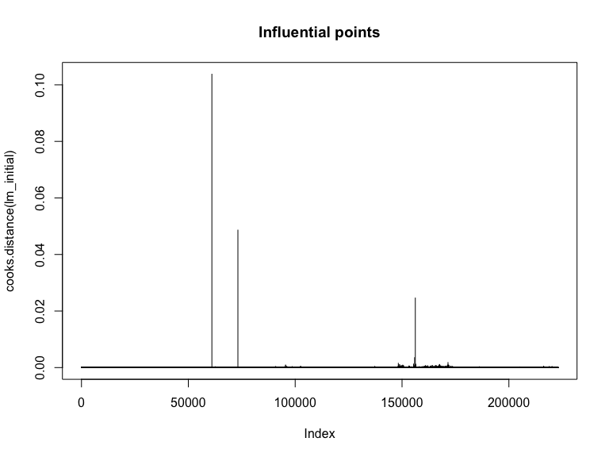

``` r
plot(cooks.distance(lm_third), type = "h", main = "Influential points removed")
```

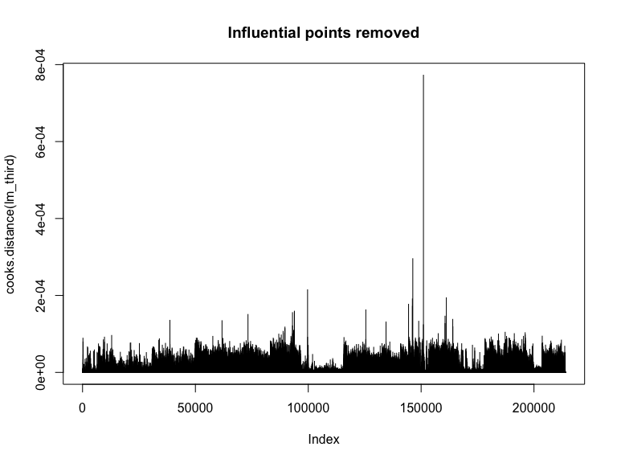

``` r
#make predictions after influential point removal
testset$pred <- predict(lm_third, newdata = testset)
sample$units <- testset[match(sample$id, testset$id), "pred"]
sample$units[is.na(sample$units)] <- 0
sample$units <- ifelse(sample$units <= 0 , 0, sample$units)
write.csv(sample, "submit3.csv", row.names = FALSE)
# kaggle score = 0.37032

library(car)
#check for collinearity
vif(lm_initial)
```

    ##                     GVIF Df GVIF^(1/(2*Df))
    ## station_nbr 1.132805e+00  1        1.064333
    ## date        2.791226e+06  1     1670.696368
    ## store_nbr   1.142611e+00  1        1.068930
    ## item_nbr    1.019275e+00  1        1.009592
    ## depart      1.206378e+00  1        1.098352
    ## heat        2.503345e+00  1        1.582196
    ## cool        2.632033e+00  1        1.622354
    ## sunrise     2.695179e+00  1        1.641700
    ## sunset      2.734260e+00  1        1.653560
    ## snowfall    1.034933e+00  1        1.017317
    ## preciptotal 1.097554e+00  1        1.047642
    ## stnpressure 1.417319e+00  1        1.190512
    ## sealevel    1.479450e+00  1        1.216327
    ## resultspeed 1.154093e+00  1        1.074287
    ## resultdir   1.098024e+00  1        1.047867
    ## day         1.082824e+00  6        1.006653
    ## month       1.688173e+06 11        1.918953
    ## year        2.844351e+06  2       41.067267
    ## day_month   2.478252e+03  1       49.782041
    ## week        3.236178e+01  1        5.688741
    ## is_holiday  1.088361e+00  1        1.043245

``` r
#remove one variable
trainset_new$date <- NULL

#fit a model
lm4 <- lm(units ~ . , data = trainset_new)

#make predictions after collinearity removal
testset$pred <- predict(lm4, newdata = testset)
sample$units <- testset[match(sample$id, testset$id), "pred"]
sample$units[is.na(sample$units)] <- 0
sample$units <- ifelse(sample$units <= 0 , 0, sample$units)
write.csv(sample, "submit4.csv", row.names = FALSE)
# kaggle score = 0.37099

#check for collinearity again
vif(lm4)
```

    ##                   GVIF Df GVIF^(1/(2*Df))
    ## station_nbr   1.145883  1        1.070459
    ## store_nbr     1.155690  1        1.075030
    ## item_nbr      1.021439  1        1.010662
    ## depart        1.195922  1        1.093582
    ## heat          2.476233  1        1.573605
    ## cool          2.605695  1        1.614217
    ## sunrise       2.676009  1        1.635851
    ## sunset        2.713481  1        1.647265
    ## snowfall      1.035836  1        1.017760
    ## preciptotal   1.098530  1        1.048108
    ## stnpressure   1.421663  1        1.192335
    ## sealevel      1.476583  1        1.215147
    ## resultspeed   1.152716  1        1.073646
    ## resultdir     1.099163  1        1.048410
    ## day           1.082668  6        1.006641
    ## month       212.966355 11        1.275946
    ## year          1.122302  2        1.029266
    ## day_month     1.252691  1        1.119237
    ## week         44.262781  1        6.653028
    ## is_holiday    1.085609  1        1.041926

``` r
#checking homoscedasticity
library(lmtest)
bptest(lm_initial)
```

    ## 
    ##  studentized Breusch-Pagan test
    ## 
    ## data:  lm_initial
    ## BP = 113.13, df = 37, p-value = 1.214e-09

``` r
#not homoscedasticity

#check for transformations
#boxcox
library(MASS)
boxcox(lm(units + 1 ~ ., data = trainset))
```

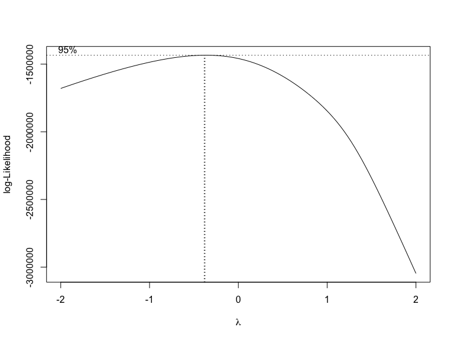

``` r
#since Lambda is closer to 0
# i take log transformations

#create a model with transformation
lm5 <- lm(log1p(units) ~ . , data = trainset_new)
summary(lm5)
```

    ## 
    ## Call:
    ## lm(formula = log1p(units) ~ ., data = trainset_new)
    ## 
    ## Residuals:
    ##     Min      1Q  Median      3Q     Max 
    ## -3.3174 -0.9095 -0.2021  0.9739  4.2926 
    ## 
    ## Coefficients:
    ##                  Estimate Std. Error  t value Pr(>|t|)    
    ## (Intercept)    -1.028e+01  5.867e-01  -17.523  < 2e-16 ***
    ## station_nbr    -1.515e-02  6.534e-04  -23.180  < 2e-16 ***
    ## store_nbr       2.285e-03  2.412e-04    9.475  < 2e-16 ***
    ## item_nbr       -2.552e-02  8.649e-05 -295.051  < 2e-16 ***
    ## depart         -1.281e-02  7.822e-04  -16.374  < 2e-16 ***
    ## heat           -7.761e-03  3.449e-04  -22.504  < 2e-16 ***
    ## cool            2.247e-02  6.391e-04   35.157  < 2e-16 ***
    ## sunrise         2.829e-03  8.600e-05   32.898  < 2e-16 ***
    ## sunset          2.940e-03  8.788e-05   33.459  < 2e-16 ***
    ## snowfall        2.736e-02  1.791e-02    1.528 0.126574    
    ## preciptotal     2.314e-02  9.727e-03    2.379 0.017379 *  
    ## stnpressure     2.301e-03  1.803e-03    1.276 0.201797    
    ## sealevel        2.037e-01  1.904e-02   10.699  < 2e-16 ***
    ## resultspeed     9.724e-03  7.676e-04   12.669  < 2e-16 ***
    ## resultdir      -2.346e-03  3.226e-04   -7.273 3.53e-13 ***
    ## dayMonday       1.479e-02  1.127e-02    1.312 0.189617    
    ## daySaturday     5.043e-02  1.099e-02    4.587 4.50e-06 ***
    ## daySunday       4.435e-02  1.105e-02    4.012 6.01e-05 ***
    ## dayThursday    -3.761e-02  1.094e-02   -3.437 0.000587 ***
    ## dayTuesday     -2.658e-02  1.108e-02   -2.400 0.016416 *  
    ## dayWednesday   -5.334e-02  1.101e-02   -4.843 1.28e-06 ***
    ## monthAugust    -2.453e-01  2.855e-02   -8.591  < 2e-16 ***
    ## monthDecember   3.046e-01  4.843e-02    6.290 3.19e-10 ***
    ## monthFebruary   8.606e-02  1.953e-02    4.407 1.05e-05 ***
    ## monthJanuary    1.579e-01  2.336e-02    6.759 1.39e-11 ***
    ## monthJuly      -3.120e-01  2.409e-02  -12.951  < 2e-16 ***
    ## monthJune      -2.300e-01  1.959e-02  -11.741  < 2e-16 ***
    ## monthMarch      6.390e-02  1.546e-02    4.135 3.56e-05 ***
    ## monthMay       -9.878e-02  1.563e-02   -6.321 2.61e-10 ***
    ## monthNovember   2.080e-01  4.487e-02    4.636 3.55e-06 ***
    ## monthOctober    7.972e-02  3.829e-02    2.082 0.037328 *  
    ## monthSeptember -1.448e-01  3.323e-02   -4.357 1.32e-05 ***
    ## year2013       -6.562e-02  7.053e-03   -9.304  < 2e-16 ***
    ## year2014       -9.891e-02  7.755e-03  -12.754  < 2e-16 ***
    ## day_month      -1.691e-03  3.787e-04   -4.466 7.99e-06 ***
    ## week           -3.195e-03  1.352e-03   -2.362 0.018158 *  
    ## is_holiday     -1.786e-01  2.015e-02   -8.863  < 2e-16 ***
    ## ---
    ## Signif. codes:  0 '***' 0.001 '**' 0.01 '*' 0.05 '.' 0.1 ' ' 1
    ## 
    ## Residual standard error: 1.367 on 213840 degrees of freedom
    ## Multiple R-squared:  0.3043, Adjusted R-squared:  0.3041 
    ## F-statistic:  2598 on 36 and 213840 DF,  p-value: < 2.2e-16

``` r
#make predictions for the model with transformations
testset$pred <- exp(predict(lm5, newdata = testset)) - 1
sample$units <- testset[match(sample$id, testset$id), "pred"]
sample$units[is.na(sample$units)] <- 0
sample$units <- ifelse(sample$units <= 0 , 0, sample$units)
write.csv(sample, "submit5.csv", row.names = FALSE)
# kaggle = 0.32593

#selecting best subset model
lm6 <- lm5
#AIC Backwards
aic_backward = step(lm6, trace = 0)
aic_backward
```

    ## 
    ## Call:
    ## lm(formula = log1p(units) ~ station_nbr + store_nbr + item_nbr + 
    ##     depart + heat + cool + sunrise + sunset + snowfall + preciptotal + 
    ##     sealevel + resultspeed + resultdir + day + month + year + 
    ##     day_month + week + is_holiday, data = trainset_new)
    ## 
    ## Coefficients:
    ##    (Intercept)     station_nbr       store_nbr        item_nbr          depart  
    ##     -10.404221       -0.015170        0.002219       -0.025520       -0.012927  
    ##           heat            cool         sunrise          sunset        snowfall  
    ##      -0.007902        0.022707        0.002807        0.002921        0.028001  
    ##    preciptotal        sealevel     resultspeed       resultdir       dayMonday  
    ##       0.024177        0.211694        0.009849       -0.002337        0.014773  
    ##    daySaturday       daySunday     dayThursday      dayTuesday    dayWednesday  
    ##       0.050454        0.044412       -0.037612       -0.026606       -0.053381  
    ##    monthAugust   monthDecember   monthFebruary    monthJanuary       monthJuly  
    ##      -0.248694        0.306850        0.088829        0.160385       -0.315808  
    ##      monthJune      monthMarch        monthMay   monthNovember    monthOctober  
    ##      -0.232954        0.065107       -0.100308        0.208381        0.078960  
    ## monthSeptember        year2013        year2014       day_month            week  
    ##      -0.147119       -0.065600       -0.098807       -0.001695       -0.003196  
    ##     is_holiday  
    ##      -0.178943

``` r
testset$pred <- exp(predict(aic_backward, newdata = testset)) - 1
sample$units <- testset[match(sample$id, testset$id), "pred"]
sample$units[is.na(sample$units)] <- 0
sample$units <- ifelse(sample$units <= 0 , 0, sample$units)
write.csv(sample, "submit7.csv", row.names = FALSE)
#kaggle score = 0.32593

#BIC backwards
bic_backward = step(lm6, trace = 0, k = log(nrow(trainset_new)))
bic_backward
```

    ## 
    ## Call:
    ## lm(formula = log1p(units) ~ station_nbr + store_nbr + item_nbr + 
    ##     depart + heat + cool + sunrise + sunset + sealevel + resultspeed + 
    ##     resultdir + day + month + year + day_month + is_holiday, 
    ##     data = trainset_new)
    ## 
    ## Coefficients:
    ##    (Intercept)     station_nbr       store_nbr        item_nbr          depart  
    ##     -10.201473       -0.015302        0.002251       -0.025515       -0.013058  
    ##           heat            cool         sunrise          sunset        sealevel  
    ##      -0.007902        0.022725        0.002772        0.002878        0.207007  
    ##    resultspeed       resultdir       dayMonday     daySaturday       daySunday  
    ##       0.009877       -0.002432        0.015083        0.051325        0.045263  
    ##    dayThursday      dayTuesday    dayWednesday     monthAugust   monthDecember  
    ##      -0.037740       -0.026991       -0.053852       -0.303478        0.200167  
    ##  monthFebruary    monthJanuary       monthJuly       monthJune      monthMarch  
    ##       0.117839        0.202381       -0.356886       -0.258986        0.080241  
    ##       monthMay   monthNovember    monthOctober  monthSeptember        year2013  
    ##      -0.113440        0.108793       -0.006064       -0.217343       -0.066631  
    ##       year2014       day_month      is_holiday  
    ##      -0.101836       -0.002085       -0.179687

``` r
testset$pred <- exp(predict(bic_backward, newdata = testset)) - 1
sample$units <- testset[match(sample$id, testset$id), "pred"]
sample$units[is.na(sample$units)] <- 0
sample$units <- ifelse(sample$units <= 0 , 0, sample$units)
write.csv(sample, "submit8.csv", row.names = FALSE)
# kaggle score = 0.32608

model_intercept = lm(log1p(units) ~ 1, data = trainset_new)
#aic forward
aic_forward = step(
  model_intercept,
  scope = list(upper = lm6),
  trace = 0,
  direction = "forward"
)
aic_forward
```

    ## 
    ## Call:
    ## lm(formula = log1p(units) ~ item_nbr + cool + month + heat + 
    ##     depart + station_nbr + sunset + sunrise + year + day + sealevel + 
    ##     resultspeed + store_nbr + is_holiday + resultdir + day_month + 
    ##     preciptotal + week + snowfall, data = trainset_new)
    ## 
    ## Coefficients:
    ##    (Intercept)        item_nbr            cool     monthAugust   monthDecember  
    ##     -10.404221       -0.025520        0.022707       -0.248694        0.306850  
    ##  monthFebruary    monthJanuary       monthJuly       monthJune      monthMarch  
    ##       0.088829        0.160385       -0.315808       -0.232954        0.065107  
    ##       monthMay   monthNovember    monthOctober  monthSeptember            heat  
    ##      -0.100308        0.208381        0.078960       -0.147119       -0.007902  
    ##         depart     station_nbr          sunset         sunrise        year2013  
    ##      -0.012927       -0.015170        0.002921        0.002807       -0.065600  
    ##       year2014       dayMonday     daySaturday       daySunday     dayThursday  
    ##      -0.098807        0.014773        0.050454        0.044412       -0.037612  
    ##     dayTuesday    dayWednesday        sealevel     resultspeed       store_nbr  
    ##      -0.026606       -0.053381        0.211694        0.009849        0.002219  
    ##     is_holiday       resultdir       day_month     preciptotal            week  
    ##      -0.178943       -0.002337       -0.001695        0.024177       -0.003196  
    ##       snowfall  
    ##       0.028001

``` r
testset$pred <- exp(predict(aic_forward, newdata = testset)) - 1
sample$units <- testset[match(sample$id, testset$id), "pred"]
sample$units[is.na(sample$units)] <- 0
sample$units <- ifelse(sample$units <= 0 , 0, sample$units)
write.csv(sample, "submit9.csv", row.names = FALSE)
#kaggle score = 0.32593

#bic forward
bic_forward = step(
  model_intercept,
  scope = list(upper = lm6),
  trace = 0,
  direction = "forward",
  k = log(nrow(trainset_new))
)
bic_forward
```

    ## 
    ## Call:
    ## lm(formula = log1p(units) ~ item_nbr + cool + month + heat + 
    ##     depart + station_nbr + sunset + sunrise + year + sealevel + 
    ##     resultspeed + day + store_nbr + is_holiday + resultdir + 
    ##     day_month, data = trainset_new)
    ## 
    ## Coefficients:
    ##    (Intercept)        item_nbr            cool     monthAugust   monthDecember  
    ##     -10.201473       -0.025515        0.022725       -0.303478        0.200167  
    ##  monthFebruary    monthJanuary       monthJuly       monthJune      monthMarch  
    ##       0.117839        0.202381       -0.356886       -0.258986        0.080241  
    ##       monthMay   monthNovember    monthOctober  monthSeptember            heat  
    ##      -0.113440        0.108793       -0.006064       -0.217343       -0.007902  
    ##         depart     station_nbr          sunset         sunrise        year2013  
    ##      -0.013058       -0.015302        0.002878        0.002772       -0.066631  
    ##       year2014        sealevel     resultspeed       dayMonday     daySaturday  
    ##      -0.101836        0.207007        0.009877        0.015083        0.051325  
    ##      daySunday     dayThursday      dayTuesday    dayWednesday       store_nbr  
    ##       0.045263       -0.037740       -0.026991       -0.053852        0.002251  
    ##     is_holiday       resultdir       day_month  
    ##      -0.179687       -0.002432       -0.002085

``` r
testset$pred <- exp(predict(bic_forward, newdata = testset)) - 1
sample$units <- testset[match(sample$id, testset$id), "pred"]
sample$units[is.na(sample$units)] <- 0
sample$units <- ifelse(sample$units <= 0 , 0, sample$units)
write.csv(sample, "submit10.csv", row.names = FALSE)
#kaggle score = 0.32477

anova(aic_backward, lm6) # good but same as before
```

    ## Analysis of Variance Table
    ## 
    ## Model 1: log1p(units) ~ station_nbr + store_nbr + item_nbr + depart + 
    ##     heat + cool + sunrise + sunset + snowfall + preciptotal + 
    ##     sealevel + resultspeed + resultdir + day + month + year + 
    ##     day_month + week + is_holiday
    ## Model 2: log1p(units) ~ station_nbr + store_nbr + item_nbr + depart + 
    ##     heat + cool + sunrise + sunset + snowfall + preciptotal + 
    ##     stnpressure + sealevel + resultspeed + resultdir + day + 
    ##     month + year + day_month + week + is_holiday
    ##   Res.Df    RSS Df Sum of Sq      F Pr(>F)
    ## 1 213841 399870                           
    ## 2 213840 399867  1    3.0467 1.6293 0.2018

``` r
anova(bic_backward, lm6) # not good
```

    ## Analysis of Variance Table
    ## 
    ## Model 1: log1p(units) ~ station_nbr + store_nbr + item_nbr + depart + 
    ##     heat + cool + sunrise + sunset + sealevel + resultspeed + 
    ##     resultdir + day + month + year + day_month + is_holiday
    ## Model 2: log1p(units) ~ station_nbr + store_nbr + item_nbr + depart + 
    ##     heat + cool + sunrise + sunset + snowfall + preciptotal + 
    ##     stnpressure + sealevel + resultspeed + resultdir + day + 
    ##     month + year + day_month + week + is_holiday
    ##   Res.Df    RSS Df Sum of Sq     F   Pr(>F)   
    ## 1 213844 399897                               
    ## 2 213840 399867  4    30.226 4.041 0.002807 **
    ## ---
    ## Signif. codes:  0 '***' 0.001 '**' 0.01 '*' 0.05 '.' 0.1 ' ' 1

``` r
anova(aic_forward, lm6) # good and one variable less
```

    ## Analysis of Variance Table
    ## 
    ## Model 1: log1p(units) ~ item_nbr + cool + month + heat + depart + station_nbr + 
    ##     sunset + sunrise + year + day + sealevel + resultspeed + 
    ##     store_nbr + is_holiday + resultdir + day_month + preciptotal + 
    ##     week + snowfall
    ## Model 2: log1p(units) ~ station_nbr + store_nbr + item_nbr + depart + 
    ##     heat + cool + sunrise + sunset + snowfall + preciptotal + 
    ##     stnpressure + sealevel + resultspeed + resultdir + day + 
    ##     month + year + day_month + week + is_holiday
    ##   Res.Df    RSS Df Sum of Sq      F Pr(>F)
    ## 1 213841 399870                           
    ## 2 213840 399867  1    3.0467 1.6293 0.2018

``` r
anova(bic_forward, lm6) # not good
```

    ## Analysis of Variance Table
    ## 
    ## Model 1: log1p(units) ~ item_nbr + cool + month + heat + depart + station_nbr + 
    ##     sunset + sunrise + year + sealevel + resultspeed + day + 
    ##     store_nbr + is_holiday + resultdir + day_month
    ## Model 2: log1p(units) ~ station_nbr + store_nbr + item_nbr + depart + 
    ##     heat + cool + sunrise + sunset + snowfall + preciptotal + 
    ##     stnpressure + sealevel + resultspeed + resultdir + day + 
    ##     month + year + day_month + week + is_holiday
    ##   Res.Df    RSS Df Sum of Sq     F   Pr(>F)   
    ## 1 213844 399897                               
    ## 2 213840 399867  4    30.226 4.041 0.002807 **
    ## ---
    ## Signif. codes:  0 '***' 0.001 '**' 0.01 '*' 0.05 '.' 0.1 ' ' 1

``` r
#using lasso for best subset selection
x <- model.matrix(lm6)
x <- x[, -1]
y <- log1p(trainset_new[[ncol(trainset_new)]])
library(glmnet)
cvfit <- glmnet::cv.glmnet(x, y, alpha = 1)
coef(cvfit, s = "lambda.1se")
```

    ## 37 x 1 sparse Matrix of class "dgCMatrix"
    ##                            1
    ## (Intercept)    -7.464892e+00
    ## station_nbr    -1.301484e-02
    ## store_nbr       1.527355e-03
    ## item_nbr       -2.517107e-02
    ## depart         -6.338492e-03
    ## heat           -3.918962e-03
    ## cool            1.572551e-02
    ## sunrise         2.895388e-03
    ## sunset          2.503861e-03
    ## snowfall        .           
    ## preciptotal     .           
    ## stnpressure     1.029158e-02
    ## sealevel        1.228791e-01
    ## resultspeed     8.184582e-03
    ## resultdir      -2.005611e-03
    ## dayMonday       .           
    ## daySaturday     3.634353e-02
    ## daySunday       2.956517e-02
    ## dayThursday    -1.101813e-02
    ## dayTuesday      .           
    ## dayWednesday   -2.611805e-02
    ## monthAugust    -1.483912e-01
    ## monthDecember   8.087749e-02
    ## monthFebruary   1.063473e-02
    ## monthJanuary    7.976459e-02
    ## monthJuly      -1.879679e-01
    ## monthJune      -1.121412e-01
    ## monthMarch      2.306341e-02
    ## monthMay       -2.654721e-02
    ## monthNovember   2.647182e-02
    ## monthOctober    .           
    ## monthSeptember -1.161756e-01
    ## year2013       -3.445552e-02
    ## year2014       -7.489689e-02
    ## day_month      -7.927984e-04
    ## week           -2.402070e-06
    ## is_holiday     -9.584924e-02

``` r
#removing snowfall and preciptotal
trainset_new$snowfall <- NULL
trainset_new$preciptotal <- NULL

#make a new moel for lasso
lm11 <- lm(log1p(units) ~ . , data = trainset_new)

#make predictions
testset$pred <- exp(predict(lm11, newdata = testset)) - 1
sample$units <- testset[match(sample$id, testset$id), "pred"]
sample$units[is.na(sample$units)] <- 0
sample$units <- ifelse(sample$units <= 0 , 0, sample$units)
write.csv(sample, "submit11.csv", row.names = FALSE)
# kaggle score = 0.32607
```

## Extra Models

We have explored the linear relationship between all our children’s
predictor variables and the sales variable. Now we’d like to check for
non-linear relationships between them and tree-based models are
perfectly suited for the same.

In a single tree model, we start with all the observations and start
splitting them based of different features, subsequently building a
top-down tree, with the leaves at the bottom representing the final
outcome of the model. At the leaf level, the observations under each
bucket are averaged to get the final outcome.

Tree-based models are largely averting to outliers and missing values.
Multicollinearity is also not an issue. At the same time, they are very
easy to interpret and often lead to extremely good accuracy scores. We
have explored 2 tree-based models, namely CatBoost and BaggedTree for
this data.

### Cross-validation

Cross-validation is the technique of dividing the training data into two
subsets, training and validation, and evaluating the performance of the
model by only training on the former subset generated. We have used
5-fold cross-validation for both the extra models, hence dividing the
data into 5 equal chunks. Each time the model is only 4 chunks out of
these 5 and is evaluated on the remaining chunk. This step is repeated 5
times and the final RMSE score is the average of all the 5 models. The
objective of doing this is that every observation gets to be a part of
the validation set exactly once.

### CatBoost

CatBoost is a type of gradient boosting algorithm which uses trees as
weak learners and works well when there are many categorical features
having a significant number of values. Boosting is a method which
involved combining weak learners to form a strong one. In the beginning,
the base learner assigned equal weight age to all observations. Many
such base models are added sequentially. In the subsequent models, the
gradient of the previous models is optimized. This is how later base
models pay more attention to rows where the previous models failed to
predict correctly. Eventually, all these weak learners are combined and
a strong learner is constructed. The most important important reason for
choosing CatBoost is its ability to deal with categorical features out
of the box without the need for any preprocessing. We have 3 categorical
variables in our data, namely “year”, “month” and “day”. Also it deals
with missing values automatically. CatBoost is also able to generate
combinations of categorical features, thus forming additional
categorical features of higher-order.

The best Kaggle score achieved is 0.099. The hyperparameters obtained
using Gridsearch are as follows: iterations - 1000 depth of tree - 10
Learning\_rate = 0.1 Rsm (random subspace method) = 0.95

### RandomForest

RandomForest is a completely different type of ensemble method, which
relies on the concept of bagging. From the original data, N samples with
replacement are generated for N trees which form the complete forest. On
average, each sample contains ~66.6% of the rows from the original data.
The idea is to show a different subset of the data to each individual
decision tree to introduce randomness in the model. At the same time,
each tree only gets to split on a subset of the total features, which is
governed by a hyperparameter. A single decision tree which is unpruned
is bound to overfit the data, which is not the case with RandomForest.
The predictions of all the trees in the model are averaged to obtain the
final predictions.

The hyperparameters used for training RandomForest are Mtry - 4 Nodesize
- 5 Ntree - 500 Results

``` r
#Catboost

library(caret)
library(catboost)

#make data format
xtrain <- trainset_new[,-ncol(trainset_new)]
ytrain <- log1p(trainset_new$units)
#categorical variables
cat_var <- which(sapply(xtrain, class) == "factor")
#pool data
train_pool <-
  catboost.load_pool(data = xtrain,
                     label = ytrain,
                     cat_features = cat_var)
#set params
params <- list(
  iterations = 1000,
  learning_rate = 0.1,
  depth = 10,
  loss_function = 'RMSE',
  eval_metric = 'RMSE',
  random_seed = 208,
  od_type = 'Iter',
  metric_period = 50,
  od_wait = 20,
  rsm = 0.95
)
#train the model
model_text <-
  catboost.train(learn_pool = train_pool,
                 params = params)
```

    ## 0:   learn: 1.5189644    total: 129ms    remaining: 2m 8s
    ## 50:  learn: 0.5785198    total: 3.38s    remaining: 1m 2s
    ## 100: learn: 0.5175871    total: 6.68s    remaining: 59.5s
    ## 150: learn: 0.4921726    total: 10s  remaining: 56.4s
    ## 200: learn: 0.4768799    total: 13.6s    remaining: 54s
    ## 250: learn: 0.4669688    total: 17.3s    remaining: 51.7s
    ## 300: learn: 0.4587797    total: 21.1s    remaining: 48.9s
    ## 350: learn: 0.4533163    total: 24.9s    remaining: 46s
    ## 400: learn: 0.4470673    total: 28.5s    remaining: 42.6s
    ## 450: learn: 0.4432422    total: 32.2s    remaining: 39.3s
    ## 500: learn: 0.4387677    total: 36.2s    remaining: 36.1s
    ## 550: learn: 0.4351458    total: 41s  remaining: 33.4s
    ## 600: learn: 0.4313475    total: 45s  remaining: 29.8s
    ## 650: learn: 0.4281401    total: 49.1s    remaining: 26.3s
    ## 700: learn: 0.4252371    total: 53.1s    remaining: 22.7s
    ## 750: learn: 0.4224457    total: 57s  remaining: 18.9s
    ## 800: learn: 0.4194436    total: 1m   remaining: 15.1s
    ## 850: learn: 0.4171683    total: 1m 4s    remaining: 11.3s
    ## 900: learn: 0.4146996    total: 1m 8s    remaining: 7.55s
    ## 950: learn: 0.4121893    total: 1m 12s   remaining: 3.74s
    ## 999: learn: 0.4099618    total: 1m 16s   remaining: 0us

``` r
#create testing data
xtest <- testset
xtest$date <- as.numeric(xtest$date)
xtest$id <- as.factor(xtest$id)
#create pool
test_pool <-
  catboost.load_pool(data = xtest,
                     cat_features = cat_var)
#make prediction
testset$pred <- exp(catboost.predict(model_text, pool = test_pool)) - 1
sample$units <- testset[match(sample$id, testset$id),"pred"]
sample$units[is.na(sample$units)] <- 0
sample$units <- ifelse(sample$units <= 0 , 0, sample$units)
write.csv(sample,"submit12.csv", row.names = FALSE)
#Kaggle score = 0.9949

#########################################################
# Random Forest
#########################################################
library(doParallel)
cl <- makePSOCKcluster(12)
registerDoParallel(cl)

start_time <- Sys.time()
ctrl <- trainControl(method = "cv", number = 3, allowParallel=TRUE)
rf_fit <- train(log1p(units) ~ ., data = trainset, method="ranger", trControl = ctrl )
```

    ## Growing trees.. Progress: 7%. Estimated remaining time: 6 minutes, 40 seconds.
    ## Growing trees.. Progress: 17%. Estimated remaining time: 5 minutes, 17 seconds.
    ## Growing trees.. Progress: 27%. Estimated remaining time: 4 minutes, 22 seconds.
    ## Growing trees.. Progress: 36%. Estimated remaining time: 3 minutes, 43 seconds.
    ## Growing trees.. Progress: 46%. Estimated remaining time: 3 minutes, 6 seconds.
    ## Growing trees.. Progress: 56%. Estimated remaining time: 2 minutes, 31 seconds.
    ## Growing trees.. Progress: 66%. Estimated remaining time: 1 minute, 56 seconds.
    ## Growing trees.. Progress: 75%. Estimated remaining time: 1 minute, 24 seconds.
    ## Growing trees.. Progress: 85%. Estimated remaining time: 51 seconds.
    ## Growing trees.. Progress: 94%. Estimated remaining time: 19 seconds.

``` r
end_time <- Sys.time()
#time taken
end_time - start_time
```

    ## Time difference of 42.74293 mins

``` r
stopCluster(cl)

rf_fit
```

    ## Random Forest 
    ## 
    ## 222969 samples
    ##     21 predictor
    ## 
    ## No pre-processing
    ## Resampling: Cross-Validated (3 fold) 
    ## Summary of sample sizes: 148647, 148646, 148645 
    ## Resampling results across tuning parameters:
    ## 
    ##   mtry  splitrule   RMSE       Rsquared   MAE      
    ##    2    variance    1.3071471  0.5689794  1.1454182
    ##    2    extratrees  1.5349829  0.4159776  1.3736975
    ##   19    variance    0.4481071  0.9350996  0.2814471
    ##   19    extratrees  0.4531845  0.9341272  0.2974057
    ##   37    variance    0.4524754  0.9337835  0.2780248
    ##   37    extratrees  0.4469293  0.9354191  0.2781273
    ## 
    ## Tuning parameter 'min.node.size' was held constant at a value of 5
    ## RMSE was used to select the optimal model using the smallest value.
    ## The final values used for the model were mtry = 37, splitrule = extratrees
    ##  and min.node.size = 5.

``` r
testset$pred <- exp(predict(rf_fit, newdata = testset)) - 1
sample$units <- testset[match(sample$id, testset$id),"pred"]
sample$units[is.na(sample$units)] <- 0
sample$units <- ifelse(sample$units <= 0 , 0, sample$units)
write.csv(sample,"submit13.csv", row.names = FALSE)
#Kaggle score = 0.09890
```

The Kaggle scores of all the four methods shown here -

  - Full linear Model = 0.39744
  - Best linear Model = 0.32593
  - CatBoost = 0.0994
  - Random Forest = 0.09890
