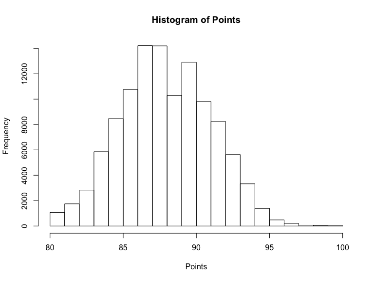
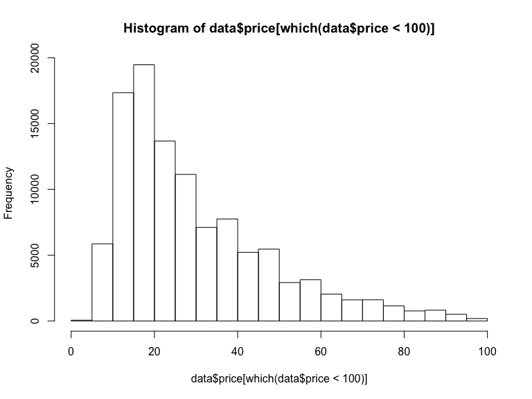
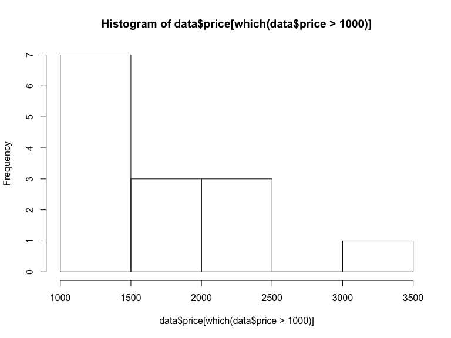
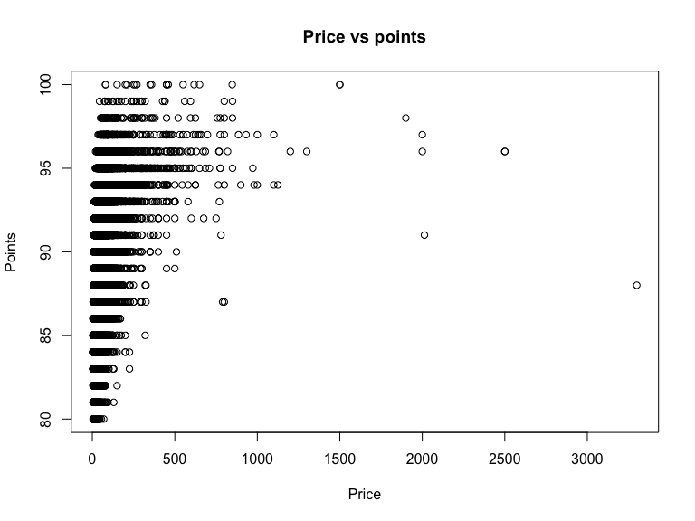
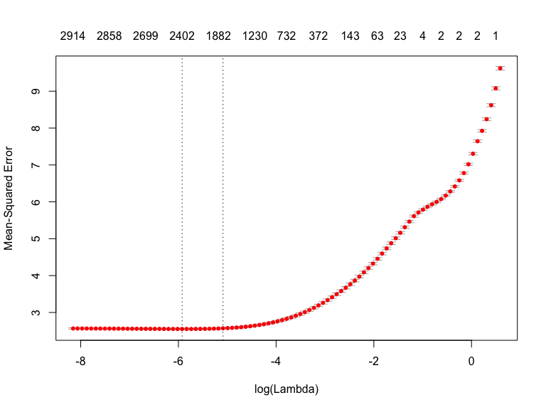
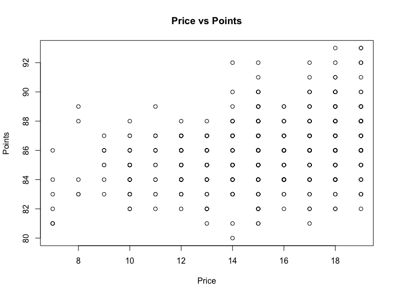
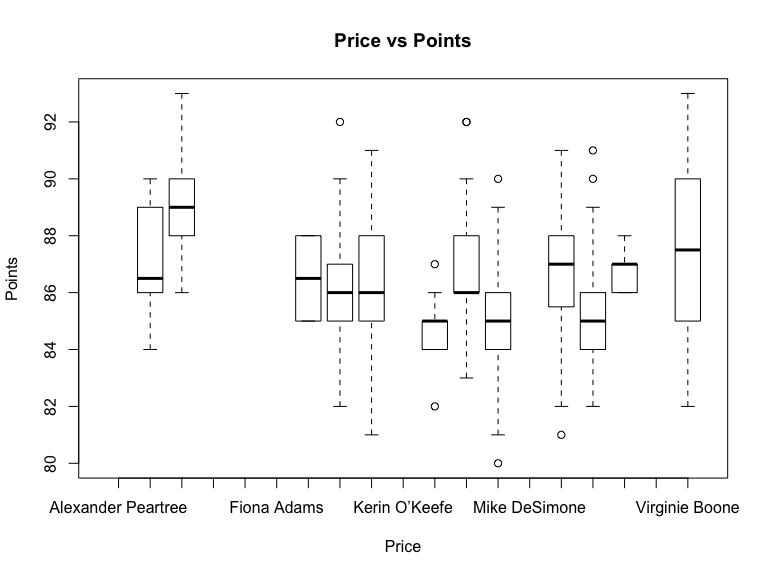

Wine Reviews
================
Rishabh Vaish
12/26/2019

## Summary

The goal of the project is to predict the wine rating given by various
tasters on the basis of their description text and some other features.
The second part of the project involves suggesting wineries on the basis
of the customer’s requirements.

For the first part, EDA shows that most of the features are text, most
important being the description of wine by the taster. I apply basic NLP
techniques like stemming and TF-IDF to extract important word-based
features. I have also engineered some new features like description
length and the age of vine present in the ‘title’. Using these features,
I have implemented two different modelling techniques namely CatBoost
and LASSO. CatBoost was used because of its ability to handle
categorical features present in data and LASSO was used due to its
feature selection paradigm. CatBoost was the better performing model
with RMSE of 1.4 as compared to RMSE of 1.6 in LASSO. For the second
part, I suggest wineries by making some assumptions about the customer
like their nationality and region. In order to convince the customer, I
use the features marked important by the CatBoost model to analyze
wineries. I devised the points per price metric to convince the customer
that the five wineries in Germany are best at the requirements
specified. Other suggestions are also provided.

## Data processing

The data processing had the following steps - \* Extract length of the
description as a feature with the name ‘desc\_lan’ \* As the title is
just unique text, I replace it by extracting the year from the title,
thus adding vintage as one of the features in place of title \* Remove
’taster\_twitter\_handle’ from the features because it gives the same
information as ‘taster\_name’ but with more missing values \* Remove
duplicate rows from the data - removed 9983 duplicate rows \* Check for
missing values column-wise, I remove the rows with missing values for
columns with less than 10% missing values - removed 8451 rows

``` r
#data load
library(readr)
library(dplyr)
data <-
  read_csv("../wine-reviews/winemag-data-130k-v2.csv", col_types = cols(X1 = col_skip()))

#adding length of description
data$desc_len <- nchar(data$description)

#replacing title with the year in title
data$title <-
  as.numeric(stringi::stri_extract_last_regex(data$title, "\\b(19|20)\\d{2}\\b"))

#removing taster_twitter_handle because it is essentially
# same as taster_name
data$taster_twitter_handle <- NULL

#remove duplicates
dim(data)
```

    ## [1] 129971     13

``` r
data <- unique(data) # removed 9983 duplicates
dim(data)
```

    ## [1] 119988     13

``` r
#column wise NA
nas <- sapply(data, function(x)
  sum(is.na(x)))
nas
```

    ##     country description designation      points       price    province    region_1 
    ##          59           0       34545           0        8395          59       19560 
    ##    region_2 taster_name       title     variety      winery    desc_len 
    ##       73219       24917        4285           1           0           0

``` r
# percentage of rows
nas <- round(100 * nas / nrow(data), 2)
nas
```

    ##     country description designation      points       price    province    region_1 
    ##        0.05        0.00       28.79        0.00        7.00        0.05       16.30 
    ##    region_2 taster_name       title     variety      winery    desc_len 
    ##       61.02       20.77        3.57        0.00        0.00        0.00

``` r
#removing NA rows in country, price, province, variety
# since these add up to less than 10% of data
dim(data)
```

    ## [1] 119988     13

``` r
data <- data[!is.na(data$country), ]
data <- data[!is.na(data$price), ]
data <- data[!is.na(data$province), ]
data <- data[!is.na(data$variety), ]
dim(data)
```

    ## [1] 111537     13

``` r
# removed 8451 rows
```

With these basic pre-processing done, I was left with data dimensions
11,537 x 13. I split the data into a test set (20%) and train set (80%)
so as to avoid any information leak to test set. The following
processing was done on the ‘description’ column separately to generate
features - \* Convert to lower case \* Remove numbers \* Remove
punctuation \* Remove English stopwords \* Remove whitespaces \* Stem
Document \* Create a TF-IDF score \* Remove words that have sparsity \>
0.999 ie words not present in 99.9% of the descriptions \* Create a
matrix of features and append it to existing features, remove the
description variable

For LASSO - One hot encode other categorical variables removing the
columns with a lot of categories eg - ‘winery’. The data was also scaled
and centered for LASSO.

This leaves us with data of columns 1947 with 89229 train rows and 22308
test rows. Now the data is ready for modelling with CatBoost. For LASSO
the data has 3094 columns with 86160 rows in training and 21541 rows in
training. Test train split and text data processing -

``` r
#making copy
data_copy <- data

#text processing
library(tm)

# text data processing
data_corpus <- SimpleCorpus(VectorSource(data$description))

data_corpus = tm_map(data_corpus, content_transformer(tolower))
data_corpus = tm_map(data_corpus, removeNumbers)
data_corpus = tm_map(data_corpus, removePunctuation)
data_corpus = tm_map(data_corpus, removeWords, c("the", "and", stopwords("english")))
data_corpus =  tm_map(data_corpus, stripWhitespace)
data_corpus <- tm_map(data_corpus, stemDocument)

#create TF-IDF weights
data_dtm_tfidf <-
  DocumentTermMatrix(data_corpus, control = list(weighting = weightTfIdf))
data_dtm <- removeSparseTerms(data_dtm_tfidf, .999)
dim(data_dtm)
```

    ## [1] 111537   1936

``` r
#convert to matrix and append
data_dtm_matrix <- as.matrix(data_dtm)
data_text <- cbind(data, data_dtm_matrix)
data <- data_text

#check character variables and convert them to factors except description
cat_var <- which(sapply(data, class) == "character")
cat_var <- cat_var[-2]
data[cat_var] <- lapply(data[cat_var] , factor)

#split into test and train
set.seed(208)
train_ind <- sample(seq_len(nrow(data)), size = 0.8 * nrow(data))
train <- data[train_ind, ]
test <- data[-train_ind, ]

xtrain <- train[,-4]
ytrain <- train$points
xtest <- test[,-4]
ytest <- test$points

#remove description column
xtrain$description <- NULL
xtest$description <- NULL

#rename a column
xtrain$price_dollar <- xtrain$price
xtrain$price <- NULL
xtest$price_dollar <- xtest$price
xtest$price <- NULL
```

## Descriptive statistics

By doing simple EDA I realized that the had a lot of categorical
variables like variety, winery country, designation, etc. These
categories have a lot of unique values for eg - there are nearly 15,000
unique wineries. One hot encoding these variables will take a lot of
time and significantly increase the data dimensions. In order to avoid
that I searched for regression techniques that handle the categorical
data as well. One such technique is CatBoost, which is short for
Category Boosting. This technique handles categorical variables with
many categories without any explicit data pre-processing. CatBoost has
been known to perform better on categorical data, as compared to other
techniques like XGBoost or LightGBM.

Categorical Features = Unique counts designation = 35753 winery = 15843
region\_1 = 1204 variety = 691

For my second technique, I decided not to use another tree-based
approach. Because of the high number of predictors in the dataset due to
text processing, I decided to use LASSO as my second technique. The
variable selection paradigm of LASSO makes it a good fit for this
problem because it will remove the less significant features thus
allowing us to build a smaller model. Moreover, the distribution of
points is nearly a bell-shaped curve, thus satisfying the normality
assumption of linear models.

``` r
#check data class
sapply(data_copy, class)
```

    ##     country description designation      points       price    province    region_1 
    ## "character" "character" "character"   "numeric"   "numeric" "character" "character" 
    ##    region_2 taster_name       title     variety      winery    desc_len 
    ## "character" "character"   "numeric" "character" "character"   "integer"

``` r
#unique values of each column
uniques <- sapply(sapply(data_copy, table), length)
uniques
```

    ##     country description designation      points       price    province    region_1 
    ##          42      111511       35753          21         390         422        1204 
    ##    region_2 taster_name       title     variety      winery    desc_len 
    ##          17          19          81         691       15843         570

``` r
#histogram of points
hist(data$points, main = "Histogram of Points", xlab = "Points")
```



``` r
#histogram of price
hist(data$price[which(data$price < 100)])
```



``` r
hist(data$price[which(data$price > 1000)])
```



``` r
#plot of price and points
plot(data$price, data$points, main = "Price vs points", xlab = "Price", ylab = "Points")
```



## Regression model analysis.

### CatBoost

The CatBoost model has the following parameters for tuning -

  - Depth = c(6, 8,10)
  - Learning\_rate = c(0.1, 0.01)
  - L2\_leaf\_reg = c(0.1, 0.01)

I have used 5 fold cross-validation for selecting the best
hyperparameters. Following are the results of cross-validation -

  - Depth = 10
  - Learning\_rate = 0.1
  - L2\_leaf\_reg = 0.1

Using these parameters, the training error reduces as iterations are
increased but the testing error stops to decrease after nearly 300
iterations. Thus I set 300 iterations.

``` r
#implement catboost with CV

# CV
library(caret)
library(catboost)

set.seed(208)

fit_control <- trainControl(method = "cv",
                            number = 5)

grid <- expand.grid(
  depth = c(6, 10),
  learning_rate = 0.1,
  iterations = 300,
  l2_leaf_reg = 0.1,
  rsm = 0.95,
  border_count = 64
)

cat_cv <- train(
  xtrain,
  ytrain,
  method = catboost.caret,
  preProc = NULL,
  logging_level = "Silent",
  tuneGrid = grid,
  trControl = fit_control
)

print(cat_cv)
```

    ## Catboost 
    ## 
    ## 89229 samples
    ##  1947 predictor
    ## 
    ## No pre-processing
    ## Resampling: Cross-Validated (5 fold) 
    ## Summary of sample sizes: 71384, 71384, 71384, 71382, 71382 
    ## Resampling results across tuning parameters:
    ## 
    ##   depth  RMSE      Rsquared   MAE     
    ##    6     1.501564  0.7664449  1.176060
    ##   10     1.431470  0.7876871  1.116761
    ## 
    ## Tuning parameter 'learning_rate' was held constant at a value of 0.1
    ## Tuning
    ##  was held constant at a value of 0.95
    ## Tuning parameter 'border_count' was held
    ##  constant at a value of 64
    ## RMSE was used to select the optimal model using the smallest value.
    ## The final values used for the model were depth = 10, learning_rate = 0.1, iterations
    ##  = 300, l2_leaf_reg = 0.1, rsm = 0.95 and border_count = 64.

``` r
#make prediction
y_pred <- predict(cat_cv, newdata = xtest)
#results
postResample(y_pred, ytest)
```

    ##      RMSE  Rsquared       MAE 
    ## 1.4193233 0.7886024 1.1037647

``` r
#feature importance
importance <- varImp(cat_cv, scale = FALSE)

#checking change of testing and training error with iterations
cat_var <- c(1, 2, 3, 6, 7, 8, 9, 10, 11, 12)
train_pool <-
  catboost.load_pool(data = xtrain,
                     label = ytrain,
                     cat_features = cat_var)
test_pool <-
  catboost.load_pool(data = xtest,
                     label = ytest,
                     cat_features = cat_var)

params <- list(
  iterations = 1000,
  learning_rate = 0.1,
  depth = 10,
  loss_function = 'RMSE',
  eval_metric = 'RMSE',
  random_seed = 208,
  od_type = 'Iter',
  metric_period = 50,
  od_wait = 20,
  rsm = 0.95,
  use_best_model = TRUE
)

model_text <-
  catboost.train(learn_pool = train_pool,
                 params = params,
                 test_pool = test_pool)
```

    ## Warning: Overfitting detector is active, thus evaluation metric is calculated on every iteration. 'metric_period' is ignored for evaluation metric.
    ## 0:   learn: 2.9409704    test: 2.9227963 best: 2.9227963 (0) total: 522ms    remaining: 8m 41s
    ## 50:  learn: 1.6762752    test: 1.6675687 best: 1.6675687 (50)    total: 26.6s    remaining: 8m 14s
    ## 100: learn: 1.5616291    test: 1.5676993 best: 1.5676993 (100)   total: 53.5s    remaining: 7m 56s
    ## 150: learn: 1.4863840    test: 1.5075591 best: 1.5075591 (150)   total: 1m 20s   remaining: 7m 31s
    ## 200: learn: 1.4308513    test: 1.4668842 best: 1.4668842 (200)   total: 1m 47s   remaining: 7m 7s
    ## 250: learn: 1.3913206    test: 1.4396288 best: 1.4396288 (250)   total: 2m 19s   remaining: 6m 57s
    ## 300: learn: 1.3592427    test: 1.4194118 best: 1.4194118 (300)   total: 2m 48s   remaining: 6m 30s
    ## 350: learn: 1.3310035    test: 1.4046245 best: 1.4046245 (350)   total: 3m 15s   remaining: 6m 2s
    ## 400: learn: 1.3071954    test: 1.3934586 best: 1.3934586 (400)   total: 3m 43s   remaining: 5m 34s
    ## 450: learn: 1.2868031    test: 1.3838659 best: 1.3838659 (450)   total: 4m 11s   remaining: 5m 5s
    ## 500: learn: 1.2673169    test: 1.3759284 best: 1.3759284 (500)   total: 4m 38s   remaining: 4m 37s
    ## 550: learn: 1.2516728    test: 1.3704929 best: 1.3704929 (550)   total: 5m 6s    remaining: 4m 10s
    ## 600: learn: 1.2358784    test: 1.3652384 best: 1.3652384 (600)   total: 5m 35s   remaining: 3m 42s
    ## 650: learn: 1.2201180    test: 1.3598127 best: 1.3598127 (650)   total: 6m 4s    remaining: 3m 15s
    ## 700: learn: 1.2066690    test: 1.3554768 best: 1.3554768 (700)   total: 6m 34s   remaining: 2m 48s
    ## 750: learn: 1.1934941    test: 1.3519759 best: 1.3519459 (749)   total: 7m 3s    remaining: 2m 20s
    ## 800: learn: 1.1804001    test: 1.3486692 best: 1.3486692 (800)   total: 7m 31s   remaining: 1m 52s
    ## 850: learn: 1.1679556    test: 1.3460081 best: 1.3460081 (850)   total: 8m   remaining: 1m 24s
    ## 900: learn: 1.1568421    test: 1.3431933 best: 1.3431933 (900)   total: 8m 31s   remaining: 56.2s
    ## 950: learn: 1.1456629    test: 1.3402787 best: 1.3402787 (950)   total: 9m 5s    remaining: 28.1s
    ## 999: learn: 1.1338920    test: 1.3385388 best: 1.3385388 (999)   total: 9m 43s   remaining: 0us
    ## 
    ## bestTest = 1.338538772
    ## bestIteration = 999

### LASSO

The lasso model just needs lambda parameter tuning. I am using the
cv.glmnet library for this. Following are the results for lambda
selected -

  - Lambda.min = 0.0027
  - Lambda.1se = 0.0062

I have selected Lambda.1se as lambda to avoid overfitting. LASSO is able
to select nearly 2400 variables out of the 3094 given. The most
important features are ranked according to their beta coefficients -

``` r
#more pre processing for LASSO
data_lasso <- data

#remove some columns with a lot of categories
data_lasso$description <- NULL
data_lasso$designation <- NULL
data_lasso$region_2 <- NULL
data_lasso$region_1 <- NULL
data_lasso$taster_name <- NULL
data_lasso$winery <- NULL
#remove NA rows remaining
data_lasso <- na.omit(data_lasso)

#split into test and train
set.seed(208)
train_ind <- sample(seq_len(nrow(data_lasso)), size = 0.8 * nrow(data_lasso))
train <- data_lasso[train_ind,]
test <- data_lasso[-train_ind,]

xtrain <- train[, -which(colnames(train) == "points")]
ytrain <- train$points
xtest <- test[, -which(colnames(test) == "points")]
ytest <- test$points

#One hot encoding variables for LASSO
dim(xtrain)
```

    ## [1] 86160  1942

``` r
dim(xtest)
```

    ## [1] 21541  1942

``` r
dummies <- dummyVars( ~ ., data = xtrain)
xtrain <- predict(dummies, newdata = xtrain)
xtest <- predict(dummies, newdata = xtest)
dim(xtrain)
```

    ## [1] 86160  3094

``` r
dim(xtest)
```

    ## [1] 21541  3094

``` r
#LASSO
library(glmnet)

set.seed(208)

#CV
glmnet_cv <- cv.glmnet(xtrain, ytrain, type.measure="mse", alpha=1, 
                          family="gaussian")
glmnet_cv$lambda.1se
```

    ## [1] 0.0061781

``` r
glmnet_cv$lambda.min
```

    ## [1] 0.002674352

``` r
#plot of LASSO
plot(glmnet_cv)
```



``` r
#make predictions
y_pred <- predict(glmnet_cv, newx = xtest, s = glmnet_cv$lambda.1se)
#results
postResample(y_pred, ytest)
```

    ##      RMSE  Rsquared       MAE 
    ## 1.6056235 0.7294162 1.2457898

LASSO gives text features as more important whereas CatBoost gives more
importance to categorical and numerical features than features extracted
from ‘description’.

The CatBoost model clearly outperforms the LASSO model. This may be
because the Catboost model is able to capture a non-linear relationship
with the variables whereas LASSO is essentially linear.

## Recommendations

I aim to recommend five different wineries for a customer that is
interested in purchasing a pinot noir, with a price less than 20
dollars, and has a fruity taste.

Firstly I create a dataset of wines which are Pinot Noir, price less
than 20$ and have a fruit word in their description. There are 515 such
cases with points ranging from 80 to 93. Since price is an important
feature for predicting points, I look at the Price vs points graph.
Clearly, the higher-priced wines have better points. Next, I look at the
next important feature country of wine. In order to arrange countries, I
find the points per price for each country and shortlist countries with
at least 5 wineries. From this, we can see that Germany has the highest
points per price ratio and second-best rating overall. Thus I recommend
all the five wineries of Germany to the consumer. If the consumer
selects Austria then we can recommend the 5 wineries there.

If Consumer decides to go with the US, we can further look at the
provinces with the best points to price ratio and at least 5 wineries.
Clearly, California based wines have the best points per price ratio
hence, I would suggest wineries in California.

We can also use the TF-IDF matrix I created earlier to further narrow
down the wineries for eg we can ask the customer the kind of taste they
like. I assume the customer wants a “rich” taste. Then we can look at
the wineries in California with “rich” present in their description and
sort them according to their TF-IDF weights.

On the basis of TF-IDF weight, I sort the wineries and recommend the top
5 on the basis of the customer’s requirements. Similarly, looking at the
weights of “fruity” word in the description to rank the wineries we get
the following wineries as top wineries in California.

``` r
#rename a column
data$price_dollar <- data$price
data$price <- NULL

#select subset with variety = pinot_noir, price < 20, fruit is word corpus
datasub <- data[grep("fruit", tolower(data$description)),]
datasub <- datasub %>% filter(variety == "Pinot Noir" & price_dollar < 20)

#Since price is an important variable if predicting taste lets look at points vs price graph.
plot(datasub$price_dollar, datasub$points, main = "Price vs Points", xlab = "Price", ylab = "Points")
```



``` r
#next look at taster name vs wine points
plot(datasub$taster_name, datasub$points, main = "Price vs Points", xlab = "Price", ylab = "Points")
```



``` r
#look at the mean points per price per country
datasub %>%
  group_by(country) %>%
  summarize(mean_points = mean(points),
            wines = n(),
            wineries = n_distinct(winery),
            mean_price = mean(price_dollar),
            points_per_price = sum(points)/sum(price_dollar)) %>%
  filter( wineries >= 5) %>%
  arrange(desc(mean_points))
```

    ## # A tibble: 8 x 6
    ##   country     mean_points wines wineries mean_price points_per_price
    ##   <fct>             <dbl> <int>    <int>      <dbl>            <dbl>
    ## 1 Austria            91       7        5       17               5.35
    ## 2 Germany            88.2     6        5       14.5             6.08
    ## 3 New Zealand        86.6    34       29       16.8             5.16
    ## 4 US                 86.1   236      169       15.4             5.58
    ## 5 Australia          86      12        8       15.8             5.46
    ## 6 France             85.3    95       64       14.9             5.71
    ## 7 Chile              85.0    81       50       13.3             6.39
    ## 8 Argentina          84.6    23       20       14.0             6.02

``` r
#recommend austria and germany, else USA

#assuming USA
data_us <- datasub %>% filter(country == "US")

#look at the mean points per price per province
data_us %>%
  group_by(province) %>%
  summarize(mean_points = mean(points),
            wines = n(),
            wineries = n_distinct(winery),
            mean_price = mean(price_dollar),
            points_per_price = sum(points)/sum(price_dollar)) %>%
  filter( wineries >= 5) %>%
  arrange(desc(mean_points))
```

    ## # A tibble: 3 x 6
    ##   province   mean_points wines wineries mean_price points_per_price
    ##   <fct>            <dbl> <int>    <int>      <dbl>            <dbl>
    ## 1 Oregon            86.3    72       45       16.5             5.24
    ## 2 California        86.0   151      115       14.9             5.75
    ## 3 New York          86       9        8       16.4             5.23

``` r
#assuming California
data_cal <- data_us %>% filter(province == "California")

#sort the data according to TF-IDF weight
data_cal %>%
  group_by(winery) %>%
  summarise( rich_measure = mean(rich)) %>%
  filter( rich_measure > 0) %>%
  arrange(desc(rich_measure))
```

    ## # A tibble: 7 x 2
    ##   winery         rich_measure
    ##   <fct>                 <dbl>
    ## 1 7 Peaks              0.164 
    ## 2 One Hope             0.154 
    ## 3 Leese-Fitch          0.125 
    ## 4 HandCraft            0.114 
    ## 5 Love Noir            0.114 
    ## 6 Parker Station       0.101 
    ## 7 Camelot              0.0728

``` r
#looking at the top wineries in california according to fruity TF-IDF weights
data_cal %>%
  group_by(winery) %>%
  summarize(fruit_measure = mean(fruit)) %>%
  filter( fruit_measure > 0) %>%
  arrange(desc(fruit_measure))
```

    ## # A tibble: 92 x 2
    ##    winery             fruit_measure
    ##    <fct>                      <dbl>
    ##  1 Zagan's Fire              0.151 
    ##  2 Leese-Fitch               0.129 
    ##  3 Fleur                     0.123 
    ##  4 Belle Ambiance            0.108 
    ##  5 Stephen Vincent           0.104 
    ##  6 Bread & Butter            0.101 
    ##  7 Gnarly Head               0.101 
    ##  8 Cartlidge & Browne        0.0968
    ##  9 Michael Pozzan            0.0968
    ## 10 Sonoma Creek              0.0935
    ## # … with 82 more rows
